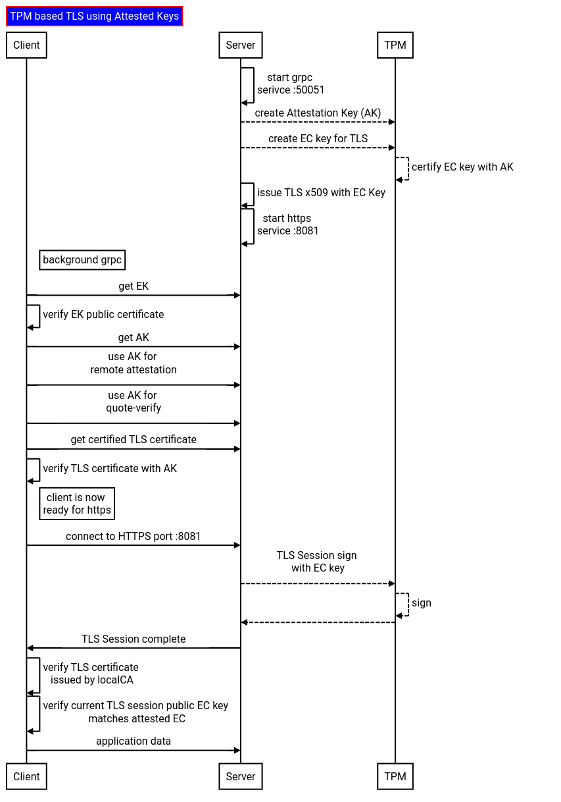

## TPM based TLS using Attested Keys

`TLS` where the private key on the server is bound to its `Trusted Platform Module (TPM)`.  That same TLS key is also attested through full [TPM Remote Attestation](https://tpm2-software.github.io/tpm2-tss/getting-started/2019/12/18/Remote-Attestation.html).

This ensures the client is connecting to the remote host where the TPM resides

Basically,

1. Server starts the gRPC service with default TLS configuration using ordinary rsa key files
2. Server creates an `Attestation Key (AK)`
3. Server creates a new elliptic key on the TPM for TLS and uses the attestation key to certify it.
4. Server issues an `x509` using a local CA for the key in step 3
5. Server launches a new `HTTPS` server where the server certificate and private key from step 3

6. Client contacts server over default TLS and requests its `Endorsement Public Key (EKPub)`
7. Client contacts server requesting `Attestation Key (AK)`
8. Client and Server perform TPM [Remote Attestation](https://tpm2-software.github.io/tpm2-tss/getting-started/2019/12/18/Remote-Attestation.html)
9. CLient and Server perform TPM [Quote-Verify](https://github.com/salrashid123/tpm2/tree/master/quote_verify) to ensure the server state is correct
10. Client connects to server and requests the attested TLS key from step 3.
11. Client verifies the TLS key is attested by the AK

10. Client connects to the HTTPs server and compares the TLS sessions EC Public Key is the same as step step 11 (meaning its talking to that TPM's key)

Basically the `gRPC` server part (1->11) does some background steps to establish trust on the EC key.

After that, a new `HTTPS` server is launched which uses the EC Key on the TPM and a certificate signed by a local CA.



so whats so good about this?  well, your client is _assured_ that they are terminating the TLS connection on that VM that includes that specific TPM.

Note the part where CA certificate (local or otherwise) which issues the x509 (step 4) isn't the critical part in this flow:  the fact that the attested _EC Public Key matches whats in the certificate and TLS session is important_.  If you wanted, instead of the attestor's CA that issues the x509, the client could've done that given the attested public key and its own CA and then returned the x509 to the server which would then be used it to start the TLS-HTTP server.  (see example [here](https://gist.github.com/salrashid123/10320c153ad6acdc31854c9775c43c0d) on how to apply a attested public key to a cert)

---

>> NOTE: this repo and code is *not* supported by google

---

### Setup

Create a VM

```bash
gcloud compute instances create attestor   \
   --zone=us-central1-a --machine-type=n2d-standard-2 --no-service-account --no-scopes \
      --image-family=ubuntu-2404-lts-amd64 --image-project=ubuntu-os-cloud --maintenance-policy=MIGRATE --min-cpu-platform="AMD Milan"  --confidential-compute-type=SEV \
      --shielded-secure-boot --shielded-vtpm --shielded-integrity-monitoring

## allow grpc
gcloud compute firewall-rules create allow-tpm-verifier  --action allow --direction INGRESS   --source-ranges 0.0.0.0/0    --rules tcp:50051

## allow http
gcloud compute firewall-rules create allow-tpm-verifier-https  --action allow --direction INGRESS   --source-ranges 0.0.0.0/0    --rules tcp:8081

$ gcloud compute instances list
NAME      ZONE           MACHINE_TYPE    PREEMPTIBLE  INTERNAL_IP    EXTERNAL_IP   STATUS
attestor  us-central1-a  n2d-standard-2               10.128.15.225  34.30.250.78  RUNNING

export ATTESTOR_ADDRESS=34.30.250.78

# optionally if you installed TPM2_TOOLS, you can print the PCR value
# on the vm type above, PCR0 is
# tpm2_pcrread sha256:0
#  sha256:
#    0 : 0xA0B5FF3383A1116BD7DC6DF177C0C2D433B9EE1813EA958FA5D166A202CB2A85
# alternatively, you can use go-tpm's pcrread: https://github.com/salrashid123/tpm2/tree/master/pcr_utils
```


Now, since we're on GCP, get the EK Signing and intermediate certificates.  For other manufacturers, you can usually lookup the manufacturers CA out of band, eg for `CN=STM TPM EK Intermediate CA 06,O=STMicroelectronics NV,C=CH` they're listed [here](https://www.st.com/resource/en/technical_note/tn1330-st-trusted-platform-module-tpm-endorsement-key-ek-certificates-stmicroelectronics.pdf)

```bash
## get the EK
gcloud compute instances get-shielded-identity attestor --format=json --zone=us-central1-a | jq -r '.encryptionKey.ekCert' > certs/ekcert.pem

## get the intermediate from the ek
curl -s $(openssl x509 -in certs/ekcert.pem -noout -text | grep -Po "((?<=CA Issuers - URI:)http://.*)$") | openssl x509 -inform DER -outform PEM -out certs/ek_intermediate.pem

## get the root from the intermediate
curl -s $(openssl x509 -in certs/ek_intermediate.pem -noout -text | grep -Po "((?<=CA Issuers - URI:)http://.*)$") | openssl x509 -inform DER -outform PEM -out certs/ek_root.pem
```


#### Attestor

SSH to the attestor, [install golang](https://go.dev/doc/install) and run

```bash
$ git clone https://github.com/salrashid123/tls_ak.git

$ go run server/grpc_attestor.go --grpcport :50051 --v=10 -alsologtostderr


    I0511 13:43:28.834045    5882 grpc_attestor.go:273] Getting EKCert
    I0511 13:43:28.852316    5882 grpc_attestor.go:293] ECCert with available Issuer: CN=EK/AK CA Intermediate,OU=Google Cloud,O=Google LLC,L=Mountain View,ST=California,C=US
    I0511 13:43:29.130769    5882 grpc_attestor.go:379] Generated ECC Public -----BEGIN PUBLIC KEY-----
    MFkwEwYHKoZIzj0CAQYIKoZIzj0DAQcDQgAEDXupyE817RiprQjr2t93BGak31Kt
    0LWS/YIINEOj4Dlzd6J/aFx57kuA7maZL8xzMkSYY/hL9gSfrYuLqByizg==
    -----END PUBLIC KEY-----
    I0511 13:43:29.130816    5882 grpc_attestor.go:390]         Issuing Cert ========
    I0511 13:43:29.145673    5882 grpc_attestor.go:454]       CSR 
    -----BEGIN CERTIFICATE REQUEST-----
    MIIBVjCB/gIBADBvMQswCQYDVQQGEwJVUzETMBEGA1UECBMKQ2FsaWZvcm5pYTEW
    MBQGA1UEBxMNTW91bnRhaW4gVmlldzEQMA4GA1UEChMHQWNtZSBDbzETMBEGA1UE
    CxMKRW50ZXJwcmlzZTEMMAoGA1UEAxMDZm9vMFkwEwYHKoZIzj0CAQYIKoZIzj0D
    AQcDQgAEDXupyE817RiprQjr2t93BGak31Kt0LWS/YIINEOj4Dlzd6J/aFx57kuA
    7maZL8xzMkSYY/hL9gSfrYuLqByizqAtMCsGCSqGSIb3DQEJDjEeMBwwGgYDVR0R
    BBMwEYIPZWNoby5kb21haW4uY29tMAoGCCqGSM49BAMCA0cAMEQCIEYYW+46UlH8
    EcVuWg89GzaV9gupvhUnpDrwrVD66eLKAiBRPlBb6M/XFT9RAxHo9yMgR11jmdW/
    qJCCmIFcJ6Zwzw==
    -----END CERTIFICATE REQUEST-----

    I0511 13:43:29.147244    5882 grpc_attestor.go:500]         cert Issuer CN=Enterprise Root CA,OU=Enterprise,O=Google,C=US
    I0511 13:43:29.147294    5882 grpc_attestor.go:503]         Issued Certificate ========
    -----BEGIN CERTIFICATE-----
    MIIC8DCCAdigAwIBAgIQYuI0klUDSaW5pkUkjixRrTANBgkqhkiG9w0BAQsFADBQ
    MQswCQYDVQQGEwJVUzEPMA0GA1UECgwGR29vZ2xlMRMwEQYDVQQLDApFbnRlcnBy
    aXNlMRswGQYDVQQDDBJFbnRlcnByaXNlIFJvb3QgQ0EwHhcNMjQwNTExMTM0MzI5
    WhcNMjUwNTExMTM0MzI5WjBvMQswCQYDVQQGEwJVUzETMBEGA1UECBMKQ2FsaWZv
    cm5pYTEWMBQGA1UEBxMNTW91bnRhaW4gVmlldzEQMA4GA1UEChMHQWNtZSBDbzET
    MBEGA1UECxMKRW50ZXJwcmlzZTEMMAoGA1UEAxMDZm9vMFkwEwYHKoZIzj0CAQYI
    KoZIzj0DAQcDQgAEDXupyE817RiprQjr2t93BGak31Kt0LWS/YIINEOj4Dlzd6J/
    aFx57kuA7maZL8xzMkSYY/hL9gSfrYuLqByizqNyMHAwDgYDVR0PAQH/BAQDAgeA
    MBMGA1UdJQQMMAoGCCsGAQUFBwMBMAwGA1UdEwEB/wQCMAAwHwYDVR0jBBgwFoAU
    BmTI/lDbzru8PoYStdKMNtVIb9owGgYDVR0RBBMwEYIPZWNoby5kb21haW4uY29t
    MA0GCSqGSIb3DQEBCwUAA4IBAQAFA803n3L1M3ASQwoz8+PV6zlb0L+O/EBLlUaA
    x5+PASdfolgH5DNfzN79Rm/kRugkIjAq9OwvEXXieeTGhqBx+Xu1Se+okfB3q/sw
    oC55Cn+3r8Z6dkWxjjwIW1T5Wb3XV4GP6WGA3nHTxG/oznUcR20ybhUiGqEAmBKn
    SRi83Ysw6VcqyYCUPDayWct2PO10PejqPEq1lSw9O4ug+yrx+jHpcaT+j7Zk7zCQ
    6dnsJ73sHNeIwmnuMAeLWb8M76rLV9gdb+wQ8wM6Dv473hIZXheq/3EIfQNsjC1x
    8dtrgP+DRn9q0g+olxYgvEsiluUeG+t6cXX9f359FkON2UgW
    -----END CERTIFICATE-----


    I0511 13:43:29.147592    5882 grpc_attestor.go:539] Starting HTTP Server on port :8081
    I0511 13:43:29.147997    5882 grpc_attestor.go:581] Starting gRPC server on port :50051


    I0511 13:44:25.690575    5882 grpc_attestor.go:112] ======= GetEK ========
    I0511 13:44:25.720134    5882 grpc_attestor.go:129] ======= GetAK ========
    I0511 13:44:25.806829    5882 grpc_attestor.go:152] ======= Attest ========
    I0511 13:44:26.090723    5882 grpc_attestor.go:181] ======= Quote ========
    I0511 13:44:26.561391    5882 grpc_attestor.go:218] ======= GetTLSKey ========

    I0511 13:44:26.728640    5882 grpc_attestor.go:257] Inbound HTTP request..


```


#### Verifier

On the laptop, run the verifier

```bash
$ git clone https://github.com/salrashid123/tls_ak.git

$ go run client/grpc_verifier.go --host=$ATTESTOR_ADDRESS:50051 \
   --appaddress=$ATTESTOR_ADDRESS:8081 \
   --expectedPCRMapSHA256=0:a0b5ff3383a1116bd7dc6df177c0c2d433b9ee1813ea958fa5d166a202cb2a85 \
    --v=10 -alsologtostderr


    I0511 09:44:25.579087  732551 grpc_verifier.go:85] =============== start GetEK ===============
    I0511 09:44:25.707023  732551 grpc_verifier.go:114]         EKCertificate ========
    -----BEGIN CERTIFICATE-----
    MIIF3DCCA8SgAwIBAgITZNxR8uwhkbYEBG2ya3vaJII5kTANBgkqhkiG9w0BAQsF
    ADCBhjELMAkGA1UEBhMCVVMxEzARBgNVBAgTCkNhbGlmb3JuaWExFjAUBgNVBAcT
    DU1vdW50YWluIFZpZXcxEzARBgNVBAoTCkdvb2dsZSBMTEMxFTATBgNVBAsTDEdv
    b2dsZSBDbG91ZDEeMBwGA1UEAxMVRUsvQUsgQ0EgSW50ZXJtZWRpYXRlMCAXDTI0
    MDUxMDE0MTkxM1oYDzIwNTQwNTAzMTQxOTEyWjBpMRYwFAYDVQQHEw11cy1jZW50
    cmFsMS1hMR4wHAYDVQQKExVHb29nbGUgQ29tcHV0ZSBFbmdpbmUxETAPBgNVBAsT
    CGNvcmUtZXNvMRwwGgYDVQQDExM1MDc2MzE0MTg3NzQwOTc1Njc0MIIBIjANBgkq
    hkiG9w0BAQEFAAOCAQ8AMIIBCgKCAQEAwzdDZPoQdU3TVx7QMd6Lvob8tR6YL88N
    asIn64UOkD4ETodSxKyPEniaLNc/Qpa5+jmic4NFB26BXNmrWvFJ5VyiG7T5x1hT
    +3YdCbUUTRzy4hy6NSaxY88vRVHL/BU+nwm8s3YOMTdr3nAXoAD75LCCHbM7xgge
    ah5XboNBLe/hZCTToa/3dfwU0b8c3ZOtBz0A17Qp4ROjicShiOu/GP9Rm68l6wm+
    JQdtdYNivXrcobVN0rNEgmBQOVbkyYh/Lq4aM9oZ5DJhES70GNVVLMzZNMyFd1b9
    PJ3XPgljwDBW7cu6uNcegL4SaNUsSjr7UWtdfDNvQT09MhE6uMAngQIDAQABo4IB
    WzCCAVcwDgYDVR0PAQH/BAQDAgUgMAwGA1UdEwEB/wQCMAAwHQYDVR0OBBYEFGL9
    UaOG3bqaEGD0ZDffov6bu0dpMB8GA1UdIwQYMBaAFOlmc1RnZhvv3WW/5ehc45EL
    mwVSMIGNBggrBgEFBQcBAQSBgDB+MHwGCCsGAQUFBzAChnBodHRwOi8vcHJpdmF0
    ZWNhLWNvbnRlbnQtNjMzYmViOTQtMDAwMC0yNWMxLWE5ZDctMDAxYTExNGJhNmU4
    LnN0b3JhZ2UuZ29vZ2xlYXBpcy5jb20vYzU5YTIyNTg5YWI0M2E1N2UzYTQvY2Eu
    Y3J0MGcGCisGAQQB1nkCARUEWTBXDA11cy1jZW50cmFsMS1hAgYA569zXpwMCGNv
    cmUtZXNvAghGcrDbuJOSOgwIYXR0ZXN0b3KgIDAeoAMCAQChAwEB/6IDAQH/owMB
    AQCkAwEBAKUDAQEAMA0GCSqGSIb3DQEBCwUAA4ICAQB8E58jEYa7CjIn0WuiNZsi
    c+e8n85EdrZJxHlOZ0emYbpLP0T7/yT+OLuFjLiU4F8jGNIBG7UK+EwTk/B8Qzdw
    BTNHkGm1aI6E0ZPDocs56PtvTD5nEaO4BBTLsNw7JUwtDkUWtclUFeObSIufvEIx
    3EaDOqjfuVLCWka4OJ0TQVSuBkgl9FdEM0IPmMWrlZo1zsAN+QUltyUXKK20+I3u
    /Wu60bEGb0Z2GoaQiTcORc7bz0eMDtvsJq+k2S3UkNlZZHG0RN1MjSXPWHriCpLG
    oXJMBOVRRc0WAAoXNM6WRMyHZIxu8BjBkW/EFAsuY/Stoab5/61P3zbTOl7rgmXY
    /TRX0D+His1B8EH52U93CG1BwMLrfSdTgpTl5PjxkRumKd6V9yXQRqvTLlldIlrG
    VtfBNgJbdcXGB+i4RNjU9D0hvGx8oV1OPKgUOSNC45cEBGVrVAeE/nLHk96uIrTD
    Lt/fadxir/2juAPAN900Yh9kvFmQ4zeku1UZmPq9yf6EA9zXkBj94b+5MUQtklHt
    oyp25YsAzpIUitTjlWnmyLpjLrnehRVcI7LFdY3omjolyMddCvSk2tyOzKJfoKSx
    1OoabQ6wWEL5Qr0ufQI0dAgiTgbqPon/dLnC3avhbLthHOWjogUeiZfGxJ192nF5
    RLphK3TNQ9Df1U3Vk7yMGw==
    -----END CERTIFICATE-----

    I0511 09:44:25.707096  732551 grpc_verifier.go:130]      EKCert  Issuer CN=EK/AK CA Intermediate,OU=Google Cloud,O=Google LLC,L=Mountain View,ST=California,C=US
    I0511 09:44:25.707123  732551 grpc_verifier.go:131]      EKCert  IssuingCertificateURL [http://privateca-content-633beb94-0000-25c1-a9d7-001a114ba6e8.storage.googleapis.com/c59a22589ab43a57e3a4/ca.crt]
    I0511 09:44:25.707140  732551 grpc_verifier.go:135]      EKCert  GCE InstanceID 5076314187740975674
    I0511 09:44:25.707147  732551 grpc_verifier.go:136]      EKCert  GCE InstanceName attestor
    I0511 09:44:25.707154  732551 grpc_verifier.go:137]      EKCert  GCE ProjectId core-eso
    I0511 09:44:25.707162  732551 grpc_verifier.go:140]     EkCert Public Key 
    -----BEGIN PUBLIC KEY-----
    MIIBIjANBgkqhkiG9w0BAQEFAAOCAQ8AMIIBCgKCAQEAwzdDZPoQdU3TVx7QMd6L
    vob8tR6YL88NasIn64UOkD4ETodSxKyPEniaLNc/Qpa5+jmic4NFB26BXNmrWvFJ
    5VyiG7T5x1hT+3YdCbUUTRzy4hy6NSaxY88vRVHL/BU+nwm8s3YOMTdr3nAXoAD7
    5LCCHbM7xggeah5XboNBLe/hZCTToa/3dfwU0b8c3ZOtBz0A17Qp4ROjicShiOu/
    GP9Rm68l6wm+JQdtdYNivXrcobVN0rNEgmBQOVbkyYh/Lq4aM9oZ5DJhES70GNVV
    LMzZNMyFd1b9PJ3XPgljwDBW7cu6uNcegL4SaNUsSjr7UWtdfDNvQT09MhE6uMAn
    gQIDAQAB
    -----END PUBLIC KEY-----

    I0511 09:44:25.707171  732551 grpc_verifier.go:142]     Verifying EKCert
    I0511 09:44:25.708156  732551 grpc_verifier.go:189]     EKCert Verified


    I0511 09:44:25.708211  732551 grpc_verifier.go:215] =============== end GetEKCert ===============
    I0511 09:44:25.708220  732551 grpc_verifier.go:217] =============== start GetAK ===============
    I0511 09:44:25.794995  732551 grpc_verifier.go:250]       ak public 
    -----BEGIN PUBLIC KEY-----
    MIIBIjANBgkqhkiG9w0BAQEFAAOCAQ8AMIIBCgKCAQEA9lTFkhBh3sCXDdq/7ftf
    5F1WTEcj3fiU9XCpR8HJyoP5T12BQbQjLW74dKtpi/tL1Hn4LSFTewH+SCoZo7+p
    oRSaKz9oPs47B6KYLcP9ke18tjC/Yer31BpO4yCrY7qAS7bGs111q7PfTflD3aj2
    HywNGHa1/C+iLu9M5VmevdjdroezX8k7j2+Q66cOO+/HVvxBteSdYBgRJo8qFj86
    PbuaY81naMyKmxCwmnrDpsZHYO1oLm+aOUSS6trXJhQfNRDyypAt6b4FR32blQzF
    eVycH3X5Vz35313vHgsnzhzv7Z9j0G1yL7o3hUCVJ8NwSD1MNobABBb+i2RZ9l3v
    QQIDAQAB
    -----END PUBLIC KEY-----

    I0511 09:44:25.795025  732551 grpc_verifier.go:251] =============== end GetAK ===============
    I0511 09:44:25.795035  732551 grpc_verifier.go:253] =============== start Attest ===============
    I0511 09:44:25.795193  732551 grpc_verifier.go:266]       Outbound Secret: nMsjP93x1n3yv0/fiKyhDJipG5RoU93jrhsFaWqj6Dw=
    I0511 09:44:26.077219  732551 grpc_verifier.go:282]       Inbound Secret: nMsjP93x1n3yv0/fiKyhDJipG5RoU93jrhsFaWqj6Dw=
    I0511 09:44:26.077248  732551 grpc_verifier.go:285]       inbound/outbound Secrets Match; accepting AK
    I0511 09:44:26.077261  732551 grpc_verifier.go:290] =============== end Attest ===============
    I0511 09:44:26.077272  732551 grpc_verifier.go:292] =============== start Quote/Verify ===============
    I0511 09:44:26.548873  732551 grpc_verifier.go:364]      quotes verified
    I0511 09:44:26.549432  732551 grpc_verifier.go:377]      secureBoot State enabled true
    I0511 09:44:26.549614  732551 grpc_verifier.go:383] =============== end Quote/Verify ===============
    I0511 09:44:26.549632  732551 grpc_verifier.go:385] =============== start NewKey ===============
    I0511 09:44:26.637555  732551 grpc_verifier.go:396]      TLSPublic Public 
    -----BEGIN PUBLIC KEY-----
    MFkwEwYHKoZIzj0CAQYIKoZIzj0DAQcDQgAEDXupyE817RiprQjr2t93BGak31Kt
    0LWS/YIINEOj4Dlzd6J/aFx57kuA7maZL8xzMkSYY/hL9gSfrYuLqByizg==
    -----END PUBLIC KEY-----
    I0511 09:44:26.637605  732551 grpc_verifier.go:399]         TLSCertificate ========
    -----BEGIN CERTIFICATE-----
    MIIC8DCCAdigAwIBAgIQYuI0klUDSaW5pkUkjixRrTANBgkqhkiG9w0BAQsFADBQ
    MQswCQYDVQQGEwJVUzEPMA0GA1UECgwGR29vZ2xlMRMwEQYDVQQLDApFbnRlcnBy
    aXNlMRswGQYDVQQDDBJFbnRlcnByaXNlIFJvb3QgQ0EwHhcNMjQwNTExMTM0MzI5
    WhcNMjUwNTExMTM0MzI5WjBvMQswCQYDVQQGEwJVUzETMBEGA1UECBMKQ2FsaWZv
    cm5pYTEWMBQGA1UEBxMNTW91bnRhaW4gVmlldzEQMA4GA1UEChMHQWNtZSBDbzET
    MBEGA1UECxMKRW50ZXJwcmlzZTEMMAoGA1UEAxMDZm9vMFkwEwYHKoZIzj0CAQYI
    KoZIzj0DAQcDQgAEDXupyE817RiprQjr2t93BGak31Kt0LWS/YIINEOj4Dlzd6J/
    aFx57kuA7maZL8xzMkSYY/hL9gSfrYuLqByizqNyMHAwDgYDVR0PAQH/BAQDAgeA
    MBMGA1UdJQQMMAoGCCsGAQUFBwMBMAwGA1UdEwEB/wQCMAAwHwYDVR0jBBgwFoAU
    BmTI/lDbzru8PoYStdKMNtVIb9owGgYDVR0RBBMwEYIPZWNoby5kb21haW4uY29t
    MA0GCSqGSIb3DQEBCwUAA4IBAQAFA803n3L1M3ASQwoz8+PV6zlb0L+O/EBLlUaA
    x5+PASdfolgH5DNfzN79Rm/kRugkIjAq9OwvEXXieeTGhqBx+Xu1Se+okfB3q/sw
    oC55Cn+3r8Z6dkWxjjwIW1T5Wb3XV4GP6WGA3nHTxG/oznUcR20ybhUiGqEAmBKn
    SRi83Ysw6VcqyYCUPDayWct2PO10PejqPEq1lSw9O4ug+yrx+jHpcaT+j7Zk7zCQ
    6dnsJ73sHNeIwmnuMAeLWb8M76rLV9gdb+wQ8wM6Dv473hIZXheq/3EIfQNsjC1x
    8dtrgP+DRn9q0g+olxYgvEsiluUeG+t6cXX9f359FkON2UgW
    -----END CERTIFICATE-----

    I0511 09:44:26.637745  732551 grpc_verifier.go:416]      TLS key verified
    I0511 09:44:26.637766  732551 grpc_verifier.go:417] =============== end NewKey ===============
    I0511 09:44:26.637786  732551 grpc_verifier.go:419] =============== start StartTLS ===============
    I0511 09:44:26.637805  732551 grpc_verifier.go:421] =============== start http client ===============
    I0511 09:44:26.745105  732551 grpc_verifier.go:459]       Issuer CN=Enterprise Root CA,OU=Enterprise,O=Google,C=US
    I0511 09:44:26.745177  732551 grpc_verifier.go:472]      peer public key 
    -----BEGIN PUBLIC KEY-----
    MFkwEwYHKoZIzj0CAQYIKoZIzj0DAQcDQgAEDXupyE817RiprQjr2t93BGak31Kt
    0LWS/YIINEOj4Dlzd6J/aFx57kuA7maZL8xzMkSYY/hL9gSfrYuLqByizg==
    -----END PUBLIC KEY-----

    I0511 09:44:26.745206  732551 grpc_verifier.go:477]      peer tls public key matched attested key
    I0511 09:44:26.745271  732551 grpc_verifier.go:489] 200 OK
    I0511 09:44:26.745321  732551 grpc_verifier.go:490] ok
```

What you'll see in the output is the full remote attestation, then a certificate issued with a specific public key where the private key is on the TPM (and is attested by AK)

The client connects to the server and prints the public key....the fact the same public keys are shown confirms the attested key on the TPM is at the other end of the TLS session.

---

Once the https server is running, you can continue to interact with it on port `:8081`

```bash
$ curl -vvv --cacert certs/issuer_ca.crt    --resolve  echo.domain.com:8081:$ATTESTOR_ADDRESS https://echo.domain.com:8081/

$ openssl s_client --connect $ATTESTOR_ADDRESS:8081
```

Note the certificate specifications and public key matches the attested EC public key that was tied to the TPM

```bash
$ openssl s_client -connect $ATTESTOR_ADDRESS:8081 | openssl x509 -pubkey -noout

-----BEGIN PUBLIC KEY-----
MFkwEwYHKoZIzj0CAQYIKoZIzj0DAQcDQgAEDXupyE817RiprQjr2t93BGak31Kt
0LWS/YIINEOj4Dlzd6J/aFx57kuA7maZL8xzMkSYY/hL9gSfrYuLqByizg==
-----END PUBLIC KEY-----

### or download and save the TLSCertificate  cert to "tlscert.crt":
$ openssl x509 -in tlscert.pem -text -noout

Certificate:
    Data:
        Version: 3 (0x2)
        Serial Number:
            62:e2:34:92:55:03:49:a5:b9:a6:45:24:8e:2c:51:ad
        Signature Algorithm: sha256WithRSAEncryption
        Issuer: C=US, O=Google, OU=Enterprise, CN=Enterprise Root CA
        Validity
            Not Before: May 11 13:43:29 2024 GMT
            Not After : May 11 13:43:29 2025 GMT
        Subject: C=US, ST=California, L=Mountain View, O=Acme Co, OU=Enterprise, CN=foo
        Subject Public Key Info:
            Public Key Algorithm: id-ecPublicKey
                Public-Key: (256 bit)
                pub:
                    04:0d:7b:a9:c8:4f:35:ed:18:a9:ad:08:eb:da:df:
                    77:04:66:a4:df:52:ad:d0:b5:92:fd:82:08:34:43:
                    a3:e0:39:73:77:a2:7f:68:5c:79:ee:4b:80:ee:66:
                    99:2f:cc:73:32:44:98:63:f8:4b:f6:04:9f:ad:8b:
                    8b:a8:1c:a2:ce
                ASN1 OID: prime256v1
                NIST CURVE: P-256
        X509v3 extensions:
            X509v3 Key Usage: critical
                Digital Signature
            X509v3 Extended Key Usage: 
                TLS Web Server Authentication
            X509v3 Basic Constraints: critical
                CA:FALSE
            X509v3 Authority Key Identifier: 
                06:64:C8:FE:50:DB:CE:BB:BC:3E:86:12:B5:D2:8C:36:D5:48:6F:DA
            X509v3 Subject Alternative Name: 
                DNS:echo.domain.com
    Signature Algorithm: sha256WithRSAEncryption

$ openssl x509 -pubkey -noout -in tlscert.crt

-----BEGIN PUBLIC KEY-----
MFkwEwYHKoZIzj0CAQYIKoZIzj0DAQcDQgAEDXupyE817RiprQjr2t93BGak31Kt
0LWS/YIINEOj4Dlzd6J/aFx57kuA7maZL8xzMkSYY/hL9gSfrYuLqByizg==
-----END PUBLIC KEY-----
```

---

Final note, GCE VMs also surface an API that returns the EKPub encryption (and signing/AK) keys:

[Sign, Verify and decode using Google Cloud vTPM Attestation Key and Certificate](https://github.com/salrashid123/gcp-vtpm-ek-ak)

compare the ekPub below against the ek returned by the server above:

```bash
$ gcloud compute instances get-shielded-identity attestor


$ gcloud compute instances get-shielded-identity attestor --format=json | jq -r '.encryptionKey.ekCert' > ekcert.pem
$ gcloud compute instances get-shielded-identity attestor --format=json | jq -r '.signingKey.ekCert' > akcert.pem

## get the EK
gcloud compute instances get-shielded-identity attestor --format=json --zone=us-central1-a | jq -r '.encryptionKey.ekCert' > certs/ekcert.pem

## get the intermediate from the ek
curl -s $(openssl x509 -in certs/ekcert.pem -noout -text | grep -Po "((?<=CA Issuers - URI:)http://.*)$") | openssl x509 -inform DER -outform PEM -out certs/ek_intermediate.pem

## get the root from the intermediate
curl -s $(openssl x509 -in certs/ek_intermediate.pem -noout -text | grep -Po "((?<=CA Issuers - URI:)http://.*)$") | openssl x509 -inform DER -outform PEM -out certs/ek_root.pem

## or by hand, (the URLs are encoded into the ekcert so your values will be different)

$ wget http://privateca-content-633beb94-0000-25c1-a9d7-001a114ba6e8.storage.googleapis.com/c59a22589ab43a57e3a4/ca.crt -O ek_intermediate.crt
$ wget http://privateca-content-62d71773-0000-21da-852e-f4f5e80d7778.storage.googleapis.com/032bf9d39db4fa06aade/ca.crt -O ek_root.crt 
$ openssl x509 -inform der -in ek_intermediate.crt -out ek_intermediate.pem
$ openssl x509 -inform der -in ek_root.crt -out ek_root.pem

$ openssl x509 -in ekcert.pem -text -noout
Certificate:
    Data:
        Version: 3 (0x2)
        Serial Number:
            64:dc:51:f2:ec:21:91:b6:04:04:6d:b2:6b:7b:da:24:82:39:91
        Signature Algorithm: sha256WithRSAEncryption
        Issuer: C=US, ST=California, L=Mountain View, O=Google LLC, OU=Google Cloud, CN=EK/AK CA Intermediate
        Validity
            Not Before: May 10 14:19:13 2024 GMT
            Not After : May  3 14:19:12 2054 GMT
        Subject: L=us-central1-a, O=Google Compute Engine, OU=core-eso, CN=5076314187740975674
        Subject Public Key Info:
            Public Key Algorithm: rsaEncryption
                Public-Key: (2048 bit)
                Modulus:
                    00:c3:
                Exponent: 65537 (0x10001)
        X509v3 extensions:
            X509v3 Key Usage: critical
                Key Encipherment
            X509v3 Basic Constraints: critical
                CA:FALSE
            X509v3 Subject Key Identifier: 
                62:FD:51:A3:86:DD:BA:9A:10:60:F4:64:37:DF:A2:FE:9B:BB:47:69
            X509v3 Authority Key Identifier: 
                E9:66:73:54:67:66:1B:EF:DD:65:BF:E5:E8:5C:E3:91:0B:9B:05:52
            Authority Information Access: 
                CA Issuers - URI:http://privateca-content-633beb94-0000-25c1-a9d7-001a114ba6e8.storage.googleapis.com/c59a22589ab43a57e3a4/ca.crt

```

#### Local Testing

You can also verify this demo locally if your user has access to both the TPM and the event log. 

For me, the TPM was issued by `CN=STM TPM EK Intermediate CA 06,O=STMicroelectronics NV,C=CH`

for which the verification  certs were found [here](https://www.st.com/resource/en/technical_note/tn1330-st-trusted-platform-module-tpm-endorsement-key-ek-certificates-stmicroelectronics.pdf)

The PCR values `PCR0` were:

```bash
$ tpm2_pcrread
  sha256:
    0 : 0x3C5B53C48B7A21E554FBB14678C67DAFD792151CD3BDC6017E35F1B4A41FF411
```

So to run, i used

```bash
export ATTESTOR_ADDRESS=127.0.0.1
go run client/grpc_verifier.go --host=127.0.0.1:50051 \
   --appaddress=$ATTESTOR_ADDRESS:8081      --ekintermediateCA=certs/stmmicro_intermediate.pem  --ekrootCA=certs/stmmicro_root.pem  --expectedPCRMapSHA256=0:3c5b53c48b7a21e554fbb14678c67dafd792151cd3bdc6017e35f1b4a41ff411     --v=10 -alsologtostderr
```