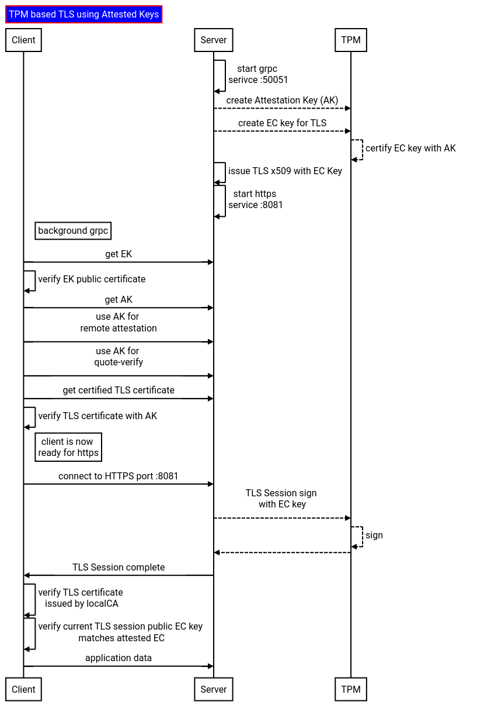
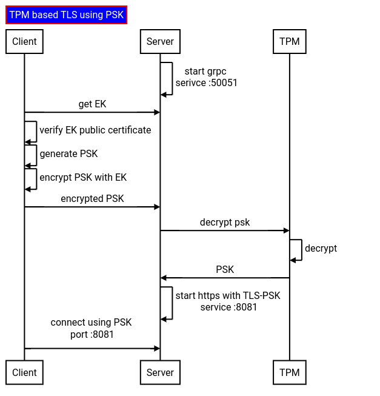

## TPM based TLS using Attested Keys

`TLS` where the private key on the server is bound to its `Trusted Platform Module (TPM)`.  That same TLS key is also attested through full [TPM Remote Attestation](https://tpm2-software.github.io/tpm2-tss/getting-started/2019/12/18/Remote-Attestation.html).

TPM based TLS is a known technology where the private key used for TLS is embedded inside a
peer's `Trusted Platform Module (TPM)`. However, TLS usually requires an x509 certificate which is
itself signed by a certificate authority the peer trusts. The remote client has to trust the certificate
issuer and that the private key resides on a TPM.

This repo describes steps whereby a remote party uses standard [TPM Remote Attestation](https://tpm2-software.github.io/tpm2-tss/getting-started/2019/12/18/Remote-Attestation.html) to ensure a keypair is resident on a TPM and then establishes TLS to the remote host by comparing
the peer's Public Key values during session setup. The distinguishing characteristic of this flow is
the TLS Certificate by itself or the CA that the peer uses is not necessarily trusted but serves as a
conduit to create the TLS session and derive the fact that the session uses the trusted public key
on the TPM. The client trusts the TLS session not based on the x509 certificate alone of the peer or
CA but by comparing the Public Key used in the session matches what is on the TPM confirmed
through remote attestation and certification of the key.

Essentially, the trusted authority that issues the x509 certificate for TLS is not strictly trusted but yet the
client can ensure the TLS session terminates on a device that is confirmed to host the session's private key

This ensures the client is connecting to the remote host where the TPM resides


1. Server starts the gRPC service with default TLS configuration using ordinary rsa key files
2. Server creates an `Attestation Key (AK)`
3. Server creates a new elliptic key on the TPM for TLS and uses the attestation key to certify it.
4. Server issues an `x509` using a local CA for the key in step 3
5. Server launches a new `HTTPS` server where the server certificate and private key from step 3

6. Client contacts server over default TLS and requests its `Endorsement Public Key (EKPub)`
7. Client contacts server requesting `Attestation Key (AK)`
8. Client and Server perform TPM [Remote Attestation](https://tpm2-software.github.io/tpm2-tss/getting-started/2019/12/18/Remote-Attestation.html)
9. CLient and Server perform TPM [Quote-Verify](https://github.com/salrashid123/tpm2/tree/master/quote_verify) to ensure the server state is correct
10. Client connects to server and requests the attested TLS key from step 3.
11. Client verifies the TLS key is attested by the AK

10. Client connects to the HTTPs server and compares the TLS sessions EC Public Key is the same as step step 11 (meaning its talking to that TPM's key)

Basically the `gRPC` server part (1->11) does some background steps to establish trust on the EC key.

After that, a new `HTTPS` server is launched which uses the EC Key on the TPM and a certificate signed by a local CA.



so whats so good about this?  well, your client is _assured_ that they are terminating the TLS connection on that VM that includes that specific TPM.

Note the part where CA certificate (local or otherwise) which issues the x509 (step 4) isn't the critical part in this flow:  the fact that the attested _EC Public Key matches whats in the certificate and TLS session is important_.  If you wanted, instead of the attestor's CA that issues the x509, the server could have sent a CSR to the client (or privacy CA) for issuance.

for reference, see

* [TPM remote attestation: How can I trust you?](https://community.infineon.com/t5/Blogs/TPM-remote-attestation-How-can-I-trust-you/ba-p/452729)
* [OpenEnclave AttestedTLS](https://github.com/openenclave/openenclave/blob/master/samples/attested_tls/AttestedTLSREADME.md)
* [Using Attestation in Transport Layer Security (TLS) and Datagram Transport Layer Security (DTLS)](https://datatracker.ietf.org/doc/draft-fossati-tls-attestation/)
* [BlindLlama TLS](https://blindllama.mithrilsecurity.io/en/latest/docs/concepts/TPMs/) 
* [TPM 2.0 Keys for Device Identity and Attestation](https://trustedcomputinggroup.org/wp-content/uploads/TPM-2p0-Keys-for-Device-Identity-and-Attestation_v1_r12_pub10082021.pdf) (`5.2 OEM Creation of IAK and IDevID in a Single Pass`)

---

>> NOTE: this repo and code is *not* supported by google

---

### Setup

There are three ways to test this:

1. locally with software tpm
2. locally with your laptop's real TPM 
3. on a cloud vm (eg GCP confidential VM with a TPM)

In the first case, we will read a real tpm's eventlog and apply the pcr values into the swtpm

in case 2 and 3, you'll need to have access to the eventlog on the attestor, eg this should return values only on the attestor

```bash
sudo tpm2_eventlog /sys/kernel/security/tpm0/binary_bios_measurement
```

In both cases, the EK Cert needs to get verified to the roots so there is a bit of legwork in getting the cert chain setup

#### SWTPM

If you want to test locally with a a software TPM, you will first need to install [swtpm](https://github.com/stefanberger/swtpm) and acquire an eventlog for quote/verify steps.

Note, the follwoing uses a sample event log acquired from a GCE instance.  The eventlog from a real GCE instance is replayed and used to increment the PCR values.  In the end, the eventlog and pcr values will match for the software TPM

First setup a swtpm with a named CA:

```bash
cd swtpm/

export XDG_CONFIG_HOME=`pwd`/config/
rm -rf myvtpm && mkdir myvtpm 
swtpm_setup --tpmstate myvtpm --tpm2 --create-ek-cert --pcr-banks sha256 --create-platform-cert --write-ek-cert-files ekcerts/ 

swtpm socket --tpmstate dir=myvtpm --tpm2 --server type=tcp,port=2321 --ctrl type=tcp,port=2322 --flags not-need-init,startup-clear --log level=2

### then synchronize the eventlog's pcr values with the swtpm
go run eventlog.go  --eventLogFile=binary_bios_measurements --tpm-path="127.0.0.1:2321"

### so the current tpm2_pcrread
export TPM2TOOLS_TCTI="swtpm:port=2321"

$ tpm2_pcrread
  sha256:
    0 : 0xA0B5FF3383A1116BD7DC6DF177C0C2D433B9EE1813EA958FA5D166A202CB2A85
    1 : 0xE50EDB964F66A7417954B1506F78A49D62062228CE84EE0B4E7E3B0E19B64A69
    2 : 0x3D458CFE55CC03EA1F443F1562BEEC8DF51C75E14A9FCF9A7234A13F198E7969
    3 : 0x3D458CFE55CC03EA1F443F1562BEEC8DF51C75E14A9FCF9A7234A13F198E7969
    4 : 0xA3358453A5148B4E3F4B96B006AE1761A2CE4AEA75F6A13E10EB3E0903DFD6E2
    5 : 0x098A2AE2D1AABED3E346B9FEF96EC64056EA4043514672243BBF40B7D0972302
    6 : 0x3D458CFE55CC03EA1F443F1562BEEC8DF51C75E14A9FCF9A7234A13F198E7969
    7 : 0x0A3F60CEA411388B09EAC782999F5E62246AB5469F9047EB508AA22C4DCD2237
    8 : 0xA775D521739876ECDE2C17D0E856C584EC513E8758D9199A3D5C735836BA0EBE
    9 : 0x4A7254A1740444F04EC61CF3F8EB8FFB5DAE2069B44AD900E894B34A07626B36
    10: 0x0000000000000000000000000000000000000000000000000000000000000000
    11: 0x0000000000000000000000000000000000000000000000000000000000000000
    12: 0x0000000000000000000000000000000000000000000000000000000000000000
    13: 0x0000000000000000000000000000000000000000000000000000000000000000
    14: 0x306F9D8B94F17D93DC6E7CF8F5C79D652EB4C6C4D13DE2DDDC24AF416E13ECAF
    15: 0x0000000000000000000000000000000000000000000000000000000000000000
    16: 0x0000000000000000000000000000000000000000000000000000000000000000
    17: 0xFFFFFFFFFFFFFFFFFFFFFFFFFFFFFFFFFFFFFFFFFFFFFFFFFFFFFFFFFFFFFFFF
    18: 0xFFFFFFFFFFFFFFFFFFFFFFFFFFFFFFFFFFFFFFFFFFFFFFFFFFFFFFFFFFFFFFFF
    19: 0xFFFFFFFFFFFFFFFFFFFFFFFFFFFFFFFFFFFFFFFFFFFFFFFFFFFFFFFFFFFFFFFF
    20: 0xFFFFFFFFFFFFFFFFFFFFFFFFFFFFFFFFFFFFFFFFFFFFFFFFFFFFFFFFFFFFFFFF
    21: 0xFFFFFFFFFFFFFFFFFFFFFFFFFFFFFFFFFFFFFFFFFFFFFFFFFFFFFFFFFFFFFFFF
    22: 0xFFFFFFFFFFFFFFFFFFFFFFFFFFFFFFFFFFFFFFFFFFFFFFFFFFFFFFFFFFFFFFFF
    23: 0x0000000000000000000000000000000000000000000000000000000000000000

### you'll see its the same as the eventlog's replay

$ tpm2_eventlog binary_bios_measurements
  sha256:
    0  : 0xa0b5ff3383a1116bd7dc6df177c0c2d433b9ee1813ea958fa5d166a202cb2a85
    1  : 0xe50edb964f66a7417954b1506f78a49d62062228ce84ee0b4e7e3b0e19b64a69
    2  : 0x3d458cfe55cc03ea1f443f1562beec8df51c75e14a9fcf9a7234a13f198e7969
    3  : 0x3d458cfe55cc03ea1f443f1562beec8df51c75e14a9fcf9a7234a13f198e7969
    4  : 0xa3358453a5148b4e3f4b96b006ae1761a2ce4aea75f6a13e10eb3e0903dfd6e2
    5  : 0x098a2ae2d1aabed3e346b9fef96ec64056ea4043514672243bbf40b7d0972302
    6  : 0x3d458cfe55cc03ea1f443f1562beec8df51c75e14a9fcf9a7234a13f198e7969
    7  : 0x0a3f60cea411388b09eac782999f5e62246ab5469f9047eb508aa22c4dcd2237
    8  : 0xa775d521739876ecde2c17d0e856c584ec513e8758d9199a3d5c735836ba0ebe
    9  : 0x4a7254a1740444f04ec61cf3f8eb8ffb5dae2069b44ad900e894b34a07626b36
    14 : 0x306f9d8b94f17d93dc6e7cf8f5c79d652eb4c6c4d13de2dddc24af416e13ecaf
```

Then run the client and server

Server:

```bash
go run server/grpc_attestor.go --grpcport :50051 --applicationPort :8081 \
   --eventLogPath=swtpm/binary_bios_measurements  --tpmDevice="127.0.0.1:2321"  \
        --v=60 -alsologtostderr

I0331 23:26:10.297632   49799 grpc_attestor.go:326] Getting EKCert
I0331 23:26:10.297742   49799 grpc_attestor.go:332] Opening swtpm socket
I0331 23:26:10.299718   49799 grpc_attestor.go:363] ECCert with available Issuer: CN=swtpm-localca
I0331 23:26:10.366991   49799 grpc_attestor.go:459] Generated ECC Public 
-----BEGIN PUBLIC KEY-----
MFkwEwYHKoZIzj0CAQYIKoZIzj0DAQcDQgAE9GJWWQPqcEr+TzyiTfc5d3/jYZki
CCjyKZ4hpdgyohs3erXGEaQJ5VCxUQLFlS9WaA4Y44+frYVmNumsbNHTbA==
-----END PUBLIC KEY-----
I0331 23:26:10.367055   49799 grpc_attestor.go:472]         Issuing Cert ========
I0331 23:26:10.374358   49799 grpc_attestor.go:609]         cert Issuer CN=Single Root TLS Issuer CA,OU=Enterprise,O=Google,C=US
I0331 23:26:10.374476   49799 grpc_attestor.go:612]         Issued Certificate ========
-----BEGIN CERTIFICATE-----
MIIDdDCCAlygAwIBAgIQettKLu36WXZt9NzoPN5nvTANBgkqhkiG9w0BAQsFADBX
MQswCQYDVQQGEwJVUzEPMA0GA1UECgwGR29vZ2xlMRMwEQYDVQQLDApFbnRlcnBy
aXNlMSIwIAYDVQQDDBlTaW5nbGUgUm9vdCBUTFMgSXNzdWVyIENBMB4XDTI2MDQw
MTAzMjYxMFoXDTI2MDQwMjAzMjYxMFowgcoxCzAJBgNVBAYTAlVTMRMwEQYDVQQI
EwpDYWxpZm9ybmlhMRYwFAYDVQQHEw1Nb3VudGFpbiBWaWV3MRAwDgYDVQQKEwdB
Y21lIENvMRMwEQYDVQQLEwpFbnRlcnByaXNlMTgwNgYDVQQDDC90cG1fc2VydmVy
IGQyNzhmODFlLTZhMTctNDFjYy04YTg5LTk1MmFlNTM5YzM1ODEtMCsGA1UEBRMk
ZDI3OGY4MWUtNmExNy00MWNjLThhODktOTUyYWU1MzljMzU4MFkwEwYHKoZIzj0C
AQYIKoZIzj0DAQcDQgAE9GJWWQPqcEr+TzyiTfc5d3/jYZkiCCjyKZ4hpdgyohs3
erXGEaQJ5VCxUQLFlS9WaA4Y44+frYVmNumsbNHTbKOBkjCBjzAOBgNVHQ8BAf8E
BAMCB4AwEwYDVR0lBAwwCgYIKwYBBQUHAwEwDAYDVR0TAQH/BAIwADAfBgNVHSME
GDAWgBRbzaql97VlJoV0gg2BK5pBDzb68DAaBgNVHREEEzARgg9lY2hvLmRvbWFp
bi5jb20wHQYDVR0gBBYwFDAIBgZngQULAQEwCAYGZ4EFCwECMA0GCSqGSIb3DQEB
CwUAA4IBAQAmNu8+F+rNNtR+UOYZWbGrEaAPSXqc+px3HWlEDMYff6Y0XdjjWPQy
QB+K8W0eB2/aFRcObWhFInLwGxwzsYOLph/XSWU7z7qpWoAYGRGPmnx3NXpz0RkE
DN/w529SxEOYYRzpDsgbodJ+DqQLWsuSfH8fMvIdnyRdn4+Eu4vo0RhZC5uOlGmf
5vC11/Im5YQrVRp/JwqWB+oxYLwZz6ZrZQoIr3nDJKxQ/xs37wSvw6mq4+n/bmp3
6IZpq5GeS2xfr4pTVBfhGGKU3zbaAgpDQe6dalOhrEGKJANvphMzf3UIZz7TCg1E
2VeqI4KX4m2x6a8lAG/n8BsXWDylNlPd
-----END CERTIFICATE-----

I0331 23:26:10.374920   49799 grpc_attestor.go:626]         Issued certificate tied to PubicKey ========
-----BEGIN PUBLIC KEY-----
MFkwEwYHKoZIzj0CAQYIKoZIzj0DAQcDQgAE9GJWWQPqcEr+TzyiTfc5d3/jYZki
CCjyKZ4hpdgyohs3erXGEaQJ5VCxUQLFlS9WaA4Y44+frYVmNumsbNHTbA==
-----END PUBLIC KEY-----

I0331 23:26:10.375236   49799 grpc_attestor.go:650] Starting HTTP Server on port :8081
I0331 23:26:10.376002   49799 grpc_attestor.go:690] Starting gRPC server on port :50051
usign signer
I0331 23:26:17.488893   49799 grpc_attestor.go:180] ======= GetEK ========
I0331 23:26:17.491294   49799 grpc_attestor.go:192] ======= GetAK ========
I0331 23:26:17.495116   49799 grpc_attestor.go:215] ======= Attest ========
I0331 23:26:17.515873   49799 grpc_attestor.go:249] ======= Quote ========
I0331 23:26:17.535460   49799 grpc_attestor.go:286] ======= GetTLSKey ========
usign signer
I0331 23:26:17.542684   49799 grpc_attestor.go:310] Inbound HTTP request from: 127.0.0.1
```

Run the client

```bash
go run client/grpc_verifier.go --host=127.0.0.1:50051  \
  --appaddress=$ATTESTOR_ADDRESS:8081  \
     --ekrootCA swtpm/config/var/lib/swtpm-localca/issuercert.pem  --expectedPCRMapSHA256=0:a0b5ff3383a1116bd7dc6df177c0c2d433b9ee1813ea958fa5d166a202cb2a85  \
        --v=60 -alsologtostder

I0331 23:26:17.480152   49962 grpc_verifier.go:95] =============== start GetEK ===============
I0331 23:26:17.489631   49962 grpc_verifier.go:235]         EKCertificate ========
-----BEGIN CERTIFICATE-----
MIID9TCCAl2gAwIBAgICBKswDQYJKoZIhvcNAQELBQAwGDEWMBQGA1UEAxMNc3d0
cG0tbG9jYWxjYTAgFw0yNjA0MDEwMzAzNTZaGA85OTk5MTIzMTIzNTk1OVowEjEQ
MA4GA1UEAxMHdW5rbm93bjCCASIwDQYJKoZIhvcNAQEBBQADggEPADCCAQoCggEB
AMFnrCATC9OHIe/G0Jq6FVeTzblT/DFg+GMn91D2uSuhl4y2jz9M0+bGUhXQpLH9
Nx17f3YO64UuwKUvvNQO81fE6q9V98sYj91an6o5CvMVgt2jXUxQJyQXoqLOjwul
KWyyDf82fCWyQ7BcQi73cT7xLx7aCHnZfm09pih/2nKbXEzuicmt8OuQtzQqf5+F
6Qg8j/UHKIPZEEZn2c3//6C1641/0bRJBm8sT3iU0VhhlRTBEidsIV2Ihte1GEzy
RxXlKqhMXxEx/HpSflHjWgJ0E99m2dgEPq+saqCMaxNc0N9XUIkwgQ3/dRG4mwaU
bSg+6EC5m93KWCfDybacRI8CAwEAAaOBzDCByTAQBgNVHSUECTAHBgVngQUIATBS
BgNVHREBAf8ESDBGpEQwQjEWMBQGBWeBBQIBDAtpZDowMDAwMTAxNDEQMA4GBWeB
BQICDAVzd3RwbTEWMBQGBWeBBQIDDAtpZDoyMDI0MDEyNTAMBgNVHRMBAf8EAjAA
MCIGA1UdCQQbMBkwFwYFZ4EFAhAxDjAMDAMyLjACAQACAgC3MB8GA1UdIwQYMBaA
FC9tUdt3Nuy5Lc3iJ4AxyLHsw4e0MA4GA1UdDwEB/wQEAwIFIDANBgkqhkiG9w0B
AQsFAAOCAYEAclj9YE+Js0ijbG+j+EoHoAtKyDgtgbwgMjaArb+j9IPBqumfueZ8
NErj24kRNYZOtFQluYOsqRbvdhx8TPaq5LRF8uDXBuL8F4EXdWajfQA6kJTQAuEf
uBdUTf52ReZoi7b2HjiSB1wMh/REfdHtoGcDK4kvlIDdizoO4lcbbNUqic2mbm4l
G0L5L9vAcwbIzSxvH9nmmbTkdrcShGsbR6+UJQCwpo2w7+NsTbpDNTh2KiDfe5H6
JxFrGa2E66IcYs/a7Hme+pWun3pOnikozpWCdLxAFp8f5dFa7yB4k45fUVKbKI3S
B8HCk26KupY+WdZlTMRLL7T/anN++oF5C2XZfNhpSlTwgAGeywYb9vWLogQhRqJ1
WemklsmV8gA6bK8mPSbRwvEiIn24DplFfyUm8wovTr1zMD0PxfkMurvXLc0XM7e9
fBfOlGjii6iAhEG+VmJw/IoUdiU8wbSKSjkTr0qXVCF8YttFIyc4Hjio63djc8YH
kivVZCjiN4v2
-----END CERTIFICATE-----

I0331 23:26:17.489755   49962 grpc_verifier.go:251]      EKCert  Issuer CN=swtpm-localca
I0331 23:26:17.489799   49962 grpc_verifier.go:252]      EKCert  IssuingCertificateURL []
I0331 23:26:17.489825   49962 grpc_verifier.go:257]     Verifying EKCert
I0331 23:26:17.490104   49962 grpc_verifier.go:285]      EKCert Includes tcg-kp-EKCertificate ExtendedKeyUsage 2.23.133.8.1
I0331 23:26:17.490598   49962 grpc_verifier.go:315]     EKCert Verified
I0331 23:26:17.490629   49962 grpc_verifier.go:317]      EKPub: 
-----BEGIN PUBLIC KEY-----
MIIBIjANBgkqhkiG9w0BAQEFAAOCAQ8AMIIBCgKCAQEAwWesIBML04ch78bQmroV
V5PNuVP8MWD4Yyf3UPa5K6GXjLaPP0zT5sZSFdCksf03HXt/dg7rhS7ApS+81A7z
V8Tqr1X3yxiP3VqfqjkK8xWC3aNdTFAnJBeios6PC6UpbLIN/zZ8JbJDsFxCLvdx
PvEvHtoIedl+bT2mKH/acptcTO6Jya3w65C3NCp/n4XpCDyP9Qcog9kQRmfZzf//
oLXrjX/RtEkGbyxPeJTRWGGVFMESJ2whXYiG17UYTPJHFeUqqExfETH8elJ+UeNa
AnQT32bZ2AQ+r6xqoIxrE1zQ31dQiTCBDf91EbibBpRtKD7oQLmb3cpYJ8PJtpxE
jwIDAQAB
-----END PUBLIC KEY-----

I0331 23:26:17.490683   49962 grpc_verifier.go:333] =============== end GetEKCert ===============
I0331 23:26:17.490716   49962 grpc_verifier.go:336] =============== start GetAK ===============
I0331 23:26:17.493934   49962 grpc_verifier.go:369]       ak public 
-----BEGIN PUBLIC KEY-----
MIIBIjANBgkqhkiG9w0BAQEFAAOCAQ8AMIIBCgKCAQEArRC/d6/GU1F8N8Njgi6L
bOTiAQnfs6rmNdGNnLZLPgP9l0n3n/V8BDdp98LstryLYFUhp8uLtxnxRI1Gpuqx
zxa60qryGvL1Bhm56y1RIkFO28/vZqRm7OO0Hmn0gqfRstPZuZPA+d1LKMBBYGvh
MGxbDZRvn+kYJC5DkGBKoV7rJe3/xXKY2st9s2p7pHWyToTLLNnTfOmXMJ7V6z7n
m3f7JJuxVppP56Dpeiizx0iNE2CYWN/ve+HMZX6jF5Le8nABj5+Yh5mTnsneyeDg
qMt/k6JCxzIu3/BVSjirHtA7dPIlg6bqwUtMUq7+lnqAQ29JClXOLx/9ZSolRtuS
2wIDAQAB
-----END PUBLIC KEY-----

I0331 23:26:17.494017   49962 grpc_verifier.go:370] =============== end GetAK ===============
I0331 23:26:17.494093   49962 grpc_verifier.go:373] =============== start Attest ===============
I0331 23:26:17.494560   49962 grpc_verifier.go:386]       Outbound Secret: V+yw8OpH7sJfjBr2Q6DymsmOPLoSk0Zqilr11OObJsc=
I0331 23:26:17.515036   49962 grpc_verifier.go:402]       Inbound Secret: V+yw8OpH7sJfjBr2Q6DymsmOPLoSk0Zqilr11OObJsc=
I0331 23:26:17.515133   49962 grpc_verifier.go:405]       inbound/outbound Secrets Match; accepting AK
I0331 23:26:17.515181   49962 grpc_verifier.go:410] =============== end Attest ===============
I0331 23:26:17.515222   49962 grpc_verifier.go:413] =============== start Quote/Verify ===============
I0331 23:26:17.533704   49962 grpc_verifier.go:458]       quote-attested public 
-----BEGIN PUBLIC KEY-----
MIIBIjANBgkqhkiG9w0BAQEFAAOCAQ8AMIIBCgKCAQEArRC/d6/GU1F8N8Njgi6L
bOTiAQnfs6rmNdGNnLZLPgP9l0n3n/V8BDdp98LstryLYFUhp8uLtxnxRI1Gpuqx
zxa60qryGvL1Bhm56y1RIkFO28/vZqRm7OO0Hmn0gqfRstPZuZPA+d1LKMBBYGvh
MGxbDZRvn+kYJC5DkGBKoV7rJe3/xXKY2st9s2p7pHWyToTLLNnTfOmXMJ7V6z7n
m3f7JJuxVppP56Dpeiizx0iNE2CYWN/ve+HMZX6jF5Le8nABj5+Yh5mTnsneyeDg
qMt/k6JCxzIu3/BVSjirHtA7dPIlg6bqwUtMUq7+lnqAQ29JClXOLx/9ZSolRtuS
2wIDAQAB
-----END PUBLIC KEY-----

I0331 23:26:17.534111   49962 grpc_verifier.go:485]      quotes verified
I0331 23:26:17.534635   49962 grpc_verifier.go:521] =============== end Quote/Verify ===============
I0331 23:26:17.534691   49962 grpc_verifier.go:524] =============== start NewKey ===============
I0331 23:26:17.536939   49962 grpc_verifier.go:536]         TLSCertificate ========
-----BEGIN CERTIFICATE-----
MIIDdDCCAlygAwIBAgIQettKLu36WXZt9NzoPN5nvTANBgkqhkiG9w0BAQsFADBX
MQswCQYDVQQGEwJVUzEPMA0GA1UECgwGR29vZ2xlMRMwEQYDVQQLDApFbnRlcnBy
aXNlMSIwIAYDVQQDDBlTaW5nbGUgUm9vdCBUTFMgSXNzdWVyIENBMB4XDTI2MDQw
MTAzMjYxMFoXDTI2MDQwMjAzMjYxMFowgcoxCzAJBgNVBAYTAlVTMRMwEQYDVQQI
EwpDYWxpZm9ybmlhMRYwFAYDVQQHEw1Nb3VudGFpbiBWaWV3MRAwDgYDVQQKEwdB
Y21lIENvMRMwEQYDVQQLEwpFbnRlcnByaXNlMTgwNgYDVQQDDC90cG1fc2VydmVy
IGQyNzhmODFlLTZhMTctNDFjYy04YTg5LTk1MmFlNTM5YzM1ODEtMCsGA1UEBRMk
ZDI3OGY4MWUtNmExNy00MWNjLThhODktOTUyYWU1MzljMzU4MFkwEwYHKoZIzj0C
AQYIKoZIzj0DAQcDQgAE9GJWWQPqcEr+TzyiTfc5d3/jYZkiCCjyKZ4hpdgyohs3
erXGEaQJ5VCxUQLFlS9WaA4Y44+frYVmNumsbNHTbKOBkjCBjzAOBgNVHQ8BAf8E
BAMCB4AwEwYDVR0lBAwwCgYIKwYBBQUHAwEwDAYDVR0TAQH/BAIwADAfBgNVHSME
GDAWgBRbzaql97VlJoV0gg2BK5pBDzb68DAaBgNVHREEEzARgg9lY2hvLmRvbWFp
bi5jb20wHQYDVR0gBBYwFDAIBgZngQULAQEwCAYGZ4EFCwECMA0GCSqGSIb3DQEB
CwUAA4IBAQAmNu8+F+rNNtR+UOYZWbGrEaAPSXqc+px3HWlEDMYff6Y0XdjjWPQy
QB+K8W0eB2/aFRcObWhFInLwGxwzsYOLph/XSWU7z7qpWoAYGRGPmnx3NXpz0RkE
DN/w529SxEOYYRzpDsgbodJ+DqQLWsuSfH8fMvIdnyRdn4+Eu4vo0RhZC5uOlGmf
5vC11/Im5YQrVRp/JwqWB+oxYLwZz6ZrZQoIr3nDJKxQ/xs37wSvw6mq4+n/bmp3
6IZpq5GeS2xfr4pTVBfhGGKU3zbaAgpDQe6dalOhrEGKJANvphMzf3UIZz7TCg1E
2VeqI4KX4m2x6a8lAG/n8BsXWDylNlPd
-----END CERTIFICATE-----

I0331 23:26:17.537100   49962 grpc_verifier.go:544]         TLCertificate Issuer CN: Single Root TLS Issuer CA
I0331 23:26:17.537170   49962 grpc_verifier.go:545]         TLCertificate Subjec : SERIALNUMBER=d278f81e-6a17-41cc-8a89-952ae539c358,CN=tpm_server d278f81e-6a17-41cc-8a89-952ae539c358,OU=Enterprise,O=Acme Co,L=Mountain View,ST=California,C=US
I0331 23:26:17.537219   49962 grpc_verifier.go:548]         Extension: OID: 2.5.29.15, Critical: true, Value (DER): 03020780
I0331 23:26:17.537276   49962 grpc_verifier.go:548]         Extension: OID: 2.5.29.37, Critical: false, Value (DER): 300a06082b06010505070301
I0331 23:26:17.537293   49962 grpc_verifier.go:548]         Extension: OID: 2.5.29.19, Critical: true, Value (DER): 3000
I0331 23:26:17.537301   49962 grpc_verifier.go:548]         Extension: OID: 2.5.29.35, Critical: false, Value (DER): 301680145bcdaaa5f7b565268574820d812b9a410f36faf0
I0331 23:26:17.537310   49962 grpc_verifier.go:548]         Extension: OID: 2.5.29.17, Critical: false, Value (DER): 3011820f6563686f2e646f6d61696e2e636f6d
I0331 23:26:17.537317   49962 grpc_verifier.go:548]         Extension: OID: 2.5.29.32, Critical: false, Value (DER): 3014300806066781050b0101300806066781050b0102
I0331 23:26:17.537349   49962 grpc_verifier.go:561]        public key from cert 
-----BEGIN PUBLIC KEY-----
MFkwEwYHKoZIzj0CAQYIKoZIzj0DAQcDQgAE9GJWWQPqcEr+TzyiTfc5d3/jYZki
CCjyKZ4hpdgyohs3erXGEaQJ5VCxUQLFlS9WaA4Y44+frYVmNumsbNHTbA==
-----END PUBLIC KEY-----

I0331 23:26:17.537663   49962 grpc_verifier.go:632]      Certified TPMNTPublic key matches public key in x509 certificate
I0331 23:26:17.537718   49962 grpc_verifier.go:638]      TLS key verified
I0331 23:26:17.537773   49962 grpc_verifier.go:639] =============== end NewKey ===============
I0331 23:26:17.537826   49962 grpc_verifier.go:642] =============== start http client ===============
I0331 23:26:17.542137   49962 grpc_verifier.go:707]       Issuer CN=Single Root TLS Issuer CA,OU=Enterprise,O=Google,C=US
I0331 23:26:17.542211   49962 grpc_verifier.go:720]        peer public key 
-----BEGIN PUBLIC KEY-----
MFkwEwYHKoZIzj0CAQYIKoZIzj0DAQcDQgAE9GJWWQPqcEr+TzyiTfc5d3/jYZki
CCjyKZ4hpdgyohs3erXGEaQJ5VCxUQLFlS9WaA4Y44+frYVmNumsbNHTbA==
-----END PUBLIC KEY-----

I0331 23:26:17.542230   49962 grpc_verifier.go:729]      peer tls public key matched attested key
I0331 23:26:17.542253   49962 grpc_verifier.go:736]      Connected to IP: 127.0.0.1
I0331 23:26:17.542948   49962 grpc_verifier.go:755] 200 OK
I0331 23:26:17.543049   49962 grpc_verifier.go:756] ok

```


#### Local TPM

You can also verify this demo locally if your user has access to both the TPM and the event log. 

For me, the TPM was issued by `C=CH, O=STMicroelectronics NV, CN=STSAFE TPM RSA Intermediate CA 10`

for which the verification  certs were found [here](https://www.st.com/resource/en/technical_note/tn1330-st-trusted-platform-module-tpm-endorsement-key-ek-certificates-stmicroelectronics.pdf)

```bash
## ekpublic
$ tpm2_createek -c ek.ctx -G rsa -u ek.pub 
$ tpm2_readpublic -c ek.ctx -o ek.pem -f PEM -Q

## ekcert
$ tpm2_getekcertificate -X -o ECcert.bin
$ openssl x509 -in ECcert.bin -inform DER -noout -text

    Certificate:
        Data:
            Version: 3 (0x2)
            Serial Number:
                7e:36:61:65:3e:7b:5a:81:74:3d:03:f1:1a:92:56:ec:ff:be:04:81
            Signature Algorithm: sha384WithRSAEncryption
            Issuer: C=CH, O=STMicroelectronics NV, CN=STSAFE TPM RSA Intermediate CA 10  <<<<<<<<<<<<<<<<<<
            Validity
                Not Before: Apr 16 10:33:45 2023 GMT
                Not After : Dec 31 23:59:59 9999 GMT
            Subject: 
            Subject Public Key Info:
                Public Key Algorithm: rsaEncryption
                    Public-Key: (2048 bit)
                    Modulus:
                        00:d2:c8:63:53:
                    Exponent: 65537 (0x10001)
            X509v3 extensions:
                X509v3 Authority Key Identifier: 
                    65:70:62:A7:10:56:91:6F:8C:7F:79:8A:92:DD:E6:D8:1D:0A:98:DA
                X509v3 Subject Alternative Name: critical
                    DirName:/tcg-at-tpmManufacturer=id:53544D20/tcg-at-tpmModel=ST33KTPM2X/tcg-at-tpmVersion=id:00090100
                X509v3 Subject Directory Attributes: 
                    TPM Specification:
        0:d=0  hl=2 l=  12 cons: SEQUENCE          
        2:d=1  hl=2 l=   3 prim:  UTF8STRING        :2.0
        7:d=1  hl=2 l=   1 prim:  INTEGER           :00
        10:d=1  hl=2 l=   2 prim:  INTEGER           :9F


                X509v3 Basic Constraints: critical
                    CA:FALSE
                X509v3 Extended Key Usage: 
                    Endorsement Key Certificate
                X509v3 Key Usage: critical
                    Key Encipherment
                Authority Information Access: 
                    CA Issuers - URI:http://sw-center.st.com/STSAFE/stsafetpmrsaint10.crt <<<<<<<<<<<<<<<<<<<
```

for my local tpm, the value for the EKCert had an issuer below so we  need to get that too

```bash
### STSAFE TPM RSA Intermediate CA 10 http://sw-center.st.com/STSAFE/stsafetpmrsaint10.crt
$ wget http://sw-center.st.com/STSAFE/stsafetpmrsaint10.crt

$ openssl x509 -in stsafetpmrsaint10.crt -inform DER -noout -text

    Certificate:
        Data:
            Version: 3 (0x2)
            Serial Number: 1073741840 (0x40000010)
            Signature Algorithm: sha384WithRSAEncryption
            Issuer: C=CH, O=STMicroelectronics NV, CN=STSAFE RSA Root CA 02
            Validity
                Not Before: Jan 20 00:00:00 2022 GMT
                Not After : Jan  1 00:00:00 2042 GMT
            Subject: C=CH, O=STMicroelectronics NV, CN=STSAFE TPM RSA Intermediate CA 10
            Subject Public Key Info:
                Public Key Algorithm: rsaEncryption
                    Public-Key: (4096 bit)
                    Modulus:
                        00:cb:b5:33:...
                    Exponent: 65537 (0x10001)
            X509v3 extensions:
                X509v3 Subject Key Identifier: 
                    65:70:62:A7:10:56:91:6F:8C:7F:79:8A:92:DD:E6:D8:1D:0A:98:DA
                X509v3 Authority Key Identifier: 
                    7C:C2:8D:BE:6E:59:D8:4A:54:03:46:9B:13:08:00:D2:F8:F0:6D:27
                X509v3 Certificate Policies: critical
                    Policy: X509v3 Any Policy
                    CPS: http://sw-center.st.com/STSAFE/
                X509v3 Key Usage: critical
                    Certificate Sign, CRL Sign
                X509v3 Basic Constraints: critical
                    CA:TRUE, pathlen:0
                Authority Information Access: 
                    CA Issuers - URI:http://sw-center.st.com/STSAFE/STSAFERsaRootCA02.crt <<<<<<<<<<<<<<<<<<<<<<<
                X509v3 CRL Distribution Points: 
                    Full Name:
                    URI:http://sw-center.st.com/STSAFE/STSAFERsaRootCA02.crl

        Signature Algorithm: sha384WithRSAEncryption 

```

Which you can also get from the doc above, page 5 

To get the root, again on pg5 of the doc `STSAFE RSA Root CA 02 http://sw-center.st.com/STSAFE/STSAFERsaRootCA02.crt`

```bash
$ wget  http://sw-center.st.com/STSAFE/STSAFERsaRootCA02.crt
$ openssl x509 -in STSAFERsaRootCA02.crt  -inform DER -noout -text
Certificate:
    Data:
        Version: 3 (0x2)
        Serial Number: 93583579283458 (0x551d20000002)
        Signature Algorithm: sha384WithRSAEncryption
        Issuer: C=CH, O=STMicroelectronics NV, CN=STSAFE RSA Root CA 02
        Validity
            Not Before: Jan 20 00:00:00 2022 GMT
            Not After : Dec 31 00:00:00 9999 GMT
        Subject: C=CH, O=STMicroelectronics NV, CN=STSAFE RSA Root CA 02
        Subject Public Key Info:
            Public Key Algorithm: rsaEncryption
                Public-Key: (4096 bit)
                Modulus:
                    00:c8:3b:47:6d:..
                Exponent: 65537 (0x10001)
        X509v3 extensions:
            X509v3 Subject Key Identifier: 
                7C:C2:8D:BE:6E:59:D8:4A:54:03:46:9B:13:08:00:D2:F8:F0:6D:27
            X509v3 Key Usage: critical
                Certificate Sign, CRL Sign
            X509v3 Basic Constraints: critical
                CA:TRUE
    Signature Algorithm: sha384WithRSAEncryption
```

The PCR values `PCR0` were:

```bash
$ tpm2_pcrread
  sha256:
    0 : 0x7BB4353897632FD086982175A027DAFCC33F61ADBAB4EBFC6D13927B97A8C084
```

Now, both of these are DER files so to convert to PEM:

```bash
openssl x509 -in stsafetpmrsaint10.crt -inform DER -noout -text certs/stsafetpmrsaint10.pem
openssl x509 -in STSAFERsaRootCA02.crt -inform DER -noout -text -out certs/stmtpmekroot.pem
```

So to run, i used

```bash
go run server/grpc_attestor.go --grpcport :50051 --applicationPort :8081  --v=10 -alsologtostderr

export ATTESTOR_ADDRESS=127.0.0.1
go run client/grpc_verifier.go --host=127.0.0.1:50051 \
   --appaddress=$ATTESTOR_ADDRESS:8081      --ekintermediateCA=certs/stsafetpmrsaint10.pem  --ekrootCA=certs/stmtpmekroot.pem  --expectedPCRMapSHA256=0:7bb4353897632fd086982175a027dafcc33f61adbab4ebfc6d13927b97a8c084     --v=10 -alsologtostderr
```

The output is like this on both ends

#### Verifier

```bash
$ go run client/grpc_verifier.go --host=127.0.0.1:50051 \
   --appaddress=$ATTESTOR_ADDRESS:8081   \
      --ekintermediateCA=certs/stsafetpmrsaint10.pem  \
       --ekrootCA=certs/stmtpmekroot.pem \
        --expectedPCRMapSHA256=0:7bb4353897632fd086982175a027dafcc33f61adbab4ebfc6d13927b97a8c084 \
            --v=10 -alsologtostderr

I1004 15:17:10.506757 3468104 grpc_verifier.go:95] =============== start GetEK ===============
I1004 15:17:10.516616 3468104 grpc_verifier.go:235]         EKCertificate ========
-----BEGIN CERTIFICATE-----
MIIFDzCCAvegAwIBAgIUfjZhZT57WoF0PQPxGpJW7P++BIEwDQYJKoZIhvcNAQEM
BQAwWTELMAkGA1UEBhMCQ0gxHjAcBgNVBAoTFVNUTWljcm9lbGVjdHJvbmljcyBO
VjEqMCgGA1UEAxMhU1RTQUZFIFRQTSBSU0EgSW50ZXJtZWRpYXRlIENBIDEwMCAX
DTIzMDQxNjEwMzM0NVoYDzk5OTkxMjMxMjM1OTU5WjAAMIIBIjANBgkqhkiG9w0B
AQEFAAOCAQ8AMIIBCgKCAQEA0shjU+4tGz+FRFoe4SVxNtZA7hGxA1MeC891SLmn
OMiXGZGgBJGPv+USVLY2OJFln4X94vvNE1Rh06HFG9FoPBA//coeFavi7cjV9GUh
3beY8wX6ergOMTxl38xbiBN6LKYuqwQ51wuMrOB5Q0n8XIJwjCfnSWGCAo16FadU
xteEixOuWbHW+If7T/j3FsHzD+QCbCYrQ1AzrHCHNsiwMAyKXdIncJnNaKi8qLDl
D4IXT2RbjijSoAFWO086Li5gwtVVoMULN4B4d83309EI11LvCiNCWGAJZ7pxTME7
+WJMurXcJec19c9M4YrjEAEggxfxKc+Bktv1ibCCeOegVwIDAQABo4IBJDCCASAw
HwYDVR0jBBgwFoAUZXBipxBWkW+Mf3mKkt3m2B0KmNowVwYDVR0RAQH/BE0wS6RJ
MEcxFjAUBgVngQUCAQwLaWQ6NTM1NDREMjAxFTATBgVngQUCAgwKU1QzM0tUUE0y
WDEWMBQGBWeBBQIDDAtpZDowMDA5MDEwMDAiBgNVHQkEGzAZMBcGBWeBBQIQMQ4w
DAwDMi4wAgEAAgIAnzAMBgNVHRMBAf8EAjAAMBAGA1UdJQQJMAcGBWeBBQgBMA4G
A1UdDwEB/wQEAwIFIDBQBggrBgEFBQcBAQREMEIwQAYIKwYBBQUHMAKGNGh0dHA6
Ly9zdy1jZW50ZXIuc3QuY29tL1NUU0FGRS9zdHNhZmV0cG1yc2FpbnQxMC5jcnQw
DQYJKoZIhvcNAQEMBQADggIBAKNipPkkgRUMAyTJh8xWRAmOP2put6d/DEuVsYRn
hvsVwJPUYc2Ki1hm8fy8OCnRAcChwQDj0tgcyAjol1qusSG5Z+pkIwdet4WLcYiE
0uf/EWMz4xvsmIDDIpn38flbAM+5XjsVczGC8/WM2DFxSllmmD5BpZDm0tBDnwCU
3bpBNoeUZ/gGoYNdDxWPnwqc5Zy1+AheaigQzGUPFKRU2xMuBkOTmdJgY357dvLZ
vVrJUWGSJq8Ee/bRgj/UFFPABLFQgV8S8x7HnMxmwUUwgHC3F94wEs5/mo/VQXbU
uJ2TlKhT3Dy/3ssKjNgVOnIOb7G54yjg2CzR8ncI9oz0QGJm4P243Zv+iBSsKTXb
2di1CxWuuE7s23ajExBnTKTfnERfeHbtiT8MUqre02kDHX8ql/xrM0fOq02+JODZ
U0DnsZI3wXDEvjRy8X+GyiDGU+wnpgycSNzoSAWvvIRxRdqcaZ4QJh9diABX41CE
teI4QdS32b7LejPcbJH566NhlPReZDFgssIEGjdYYLaGFZdya3YEqgZMfyRfVL16
93DBivvYwgtyqQj+aKAhAGLJTQEXqdQh662hMPZ5bBQS8FZ8MncS6CodLYvsXJUw
qYloxK9lcNDk0rkIibqzSUL1+lPbpQwE2xV+LQZbNIyj2hQ6XTYmwrsT+C8Fp/vU
Cfz7
-----END CERTIFICATE-----

I1004 15:17:10.516782 3468104 grpc_verifier.go:251]      EKCert  Issuer CN=STSAFE TPM RSA Intermediate CA 10,O=STMicroelectronics NV,C=CH
I1004 15:17:10.516869 3468104 grpc_verifier.go:252]      EKCert  IssuingCertificateURL [http://sw-center.st.com/STSAFE/stsafetpmrsaint10.crt]
I1004 15:17:10.516898 3468104 grpc_verifier.go:257]     Verifying EKCert
I1004 15:17:10.517241 3468104 grpc_verifier.go:285]      EKCert Includes tcg-kp-EKCertificate ExtendedKeyUsage 2.23.133.8.1
I1004 15:17:10.519039 3468104 grpc_verifier.go:312]     EKCert Verified
I1004 15:17:10.519095 3468104 grpc_verifier.go:314]      EKPub: 
-----BEGIN PUBLIC KEY-----
MIIBIjANBgkqhkiG9w0BAQEFAAOCAQ8AMIIBCgKCAQEA0shjU+4tGz+FRFoe4SVx
NtZA7hGxA1MeC891SLmnOMiXGZGgBJGPv+USVLY2OJFln4X94vvNE1Rh06HFG9Fo
PBA//coeFavi7cjV9GUh3beY8wX6ergOMTxl38xbiBN6LKYuqwQ51wuMrOB5Q0n8
XIJwjCfnSWGCAo16FadUxteEixOuWbHW+If7T/j3FsHzD+QCbCYrQ1AzrHCHNsiw
MAyKXdIncJnNaKi8qLDlD4IXT2RbjijSoAFWO086Li5gwtVVoMULN4B4d83309EI
11LvCiNCWGAJZ7pxTME7+WJMurXcJec19c9M4YrjEAEggxfxKc+Bktv1ibCCeOeg
VwIDAQAB
-----END PUBLIC KEY-----

I1004 15:17:10.519175 3468104 grpc_verifier.go:330] =============== end GetEKCert ===============
I1004 15:17:10.519211 3468104 grpc_verifier.go:333] =============== start GetAK ===============
I1004 15:17:10.941154 3468104 grpc_verifier.go:366]       ak public 
-----BEGIN PUBLIC KEY-----
MIIBIjANBgkqhkiG9w0BAQEFAAOCAQ8AMIIBCgKCAQEAzIVIhExwXD6mAWq2DDNm
SOCQgbJjgBAhXocB3X92QAb2Mq9/uq7qCuUelpKkJG0yXg47XDWb5HwiME67lZZX
YwOfPufTcyEZGZtoZ7HPYaGE1P8tToMsvBcL7B72f0LsRTovT2z/0eUhu3qZYUk4
pJTjGA2Avp6q6oRL8LvXZu/663Z9tpA1N636PISYaqfIDjF96/C3Zs21FAByZuGP
AUbMkIBTKbohTET+3ub0jAJC4lluoj5IHvh2DDFntKkp3IrWkFDYsr7Er718aaXO
+WqNQlD6+rSe96Xriuupuepl69MILBBi6/EUblsainMiqnlD3U6bOOUSMtKFyaUm
fQIDAQAB
-----END PUBLIC KEY-----

I1004 15:17:10.941248 3468104 grpc_verifier.go:367] =============== end GetAK ===============
I1004 15:17:10.941291 3468104 grpc_verifier.go:370] =============== start Attest ===============
I1004 15:17:10.941821 3468104 grpc_verifier.go:383]       Outbound Secret: 0aoYEFewrDlouNNFVg352om8xeKlmG2YXfQnn0fZiww=
I1004 15:17:12.944150 3468104 grpc_verifier.go:399]       Inbound Secret: 0aoYEFewrDlouNNFVg352om8xeKlmG2YXfQnn0fZiww=
I1004 15:17:12.944252 3468104 grpc_verifier.go:402]       inbound/outbound Secrets Match; accepting AK
I1004 15:17:12.944296 3468104 grpc_verifier.go:407] =============== end Attest ===============
I1004 15:17:12.944328 3468104 grpc_verifier.go:410] =============== start Quote/Verify ===============
I1004 15:17:19.159058 3468104 grpc_verifier.go:455]       quote-attested public 
-----BEGIN PUBLIC KEY-----
MIIBIjANBgkqhkiG9w0BAQEFAAOCAQ8AMIIBCgKCAQEAzIVIhExwXD6mAWq2DDNm
SOCQgbJjgBAhXocB3X92QAb2Mq9/uq7qCuUelpKkJG0yXg47XDWb5HwiME67lZZX
YwOfPufTcyEZGZtoZ7HPYaGE1P8tToMsvBcL7B72f0LsRTovT2z/0eUhu3qZYUk4
pJTjGA2Avp6q6oRL8LvXZu/663Z9tpA1N636PISYaqfIDjF96/C3Zs21FAByZuGP
AUbMkIBTKbohTET+3ub0jAJC4lluoj5IHvh2DDFntKkp3IrWkFDYsr7Er718aaXO
+WqNQlD6+rSe96Xriuupuepl69MILBBi6/EUblsainMiqnlD3U6bOOUSMtKFyaUm
fQIDAQAB
-----END PUBLIC KEY-----

I1004 15:17:19.159315 3468104 grpc_verifier.go:482]      quotes verified
I1004 15:17:19.159671 3468104 grpc_verifier.go:518] =============== end Quote/Verify ===============
I1004 15:17:19.159734 3468104 grpc_verifier.go:521] =============== start NewKey ===============
I1004 15:17:19.571076 3468104 grpc_verifier.go:533]         TLSCertificate ========
-----BEGIN CERTIFICATE-----
MIIDdDCCAlygAwIBAgIQf3NkrwTMf3NuYmgaPXKNFTANBgkqhkiG9w0BAQsFADBX
MQswCQYDVQQGEwJVUzEPMA0GA1UECgwGR29vZ2xlMRMwEQYDVQQLDApFbnRlcnBy
aXNlMSIwIAYDVQQDDBlTaW5nbGUgUm9vdCBUTFMgSXNzdWVyIENBMB4XDTI1MTAw
NDA2MTcwMloXDTI1MTAwNTA2MTcwMlowgcoxCzAJBgNVBAYTAlVTMRMwEQYDVQQI
EwpDYWxpZm9ybmlhMRYwFAYDVQQHEw1Nb3VudGFpbiBWaWV3MRAwDgYDVQQKEwdB
Y21lIENvMRMwEQYDVQQLEwpFbnRlcnByaXNlMTgwNgYDVQQDDC90cG1fc2VydmVy
IDY2YjU1YTNkLWUxY2ItNDZkNi05MjhmLWM4MjRhZjI4ZjdjZjEtMCsGA1UEBRMk
NjZiNTVhM2QtZTFjYi00NmQ2LTkyOGYtYzgyNGFmMjhmN2NmMFkwEwYHKoZIzj0C
AQYIKoZIzj0DAQcDQgAEJzdCPv9URzkVwuehzHfVbvLSF8wykTHu5ZEzf49yC8Cg
6UOqe+JR5B/mgFCgCxY/hZzPwOgvS3SIVyGHQWU4sKOBkjCBjzAOBgNVHQ8BAf8E
BAMCB4AwEwYDVR0lBAwwCgYIKwYBBQUHAwEwDAYDVR0TAQH/BAIwADAfBgNVHSME
GDAWgBRbzaql97VlJoV0gg2BK5pBDzb68DAaBgNVHREEEzARgg9lY2hvLmRvbWFp
bi5jb20wHQYDVR0gBBYwFDAIBgZngQULAQEwCAYGZ4EFCwECMA0GCSqGSIb3DQEB
CwUAA4IBAQAlM++WRmMPtQuBuLVxYPI07mp/1TFjm5xPKZMGvIif6UMxGHsqhSyt
3XRS+crVV1Apx2ZdOJvZ3keNvfp9yyyFTiL+iX2/S9//9DkB5XuHbshFK0vv4uxC
oF+7qoe4iZSNi8hUmr+dZElLR/VVC3Qlbxqchq7aZs0cyTBo80JaL7tWNVSZwgR8
NYeimADu6dfIWfr2Jrf7pO9MSvvT6yLwMPeVCmEAXIzruuaSpaIUjmN7aHAlOxsa
HeLD6WHFmpdnloEawW0Q8D15yDi8iwyGdIDDpY4Cu9vcqQwAm8k+6229mhlsvBkG
VyXrQ9YSVBCmRBuVxNG7bpOwMLmYFRnQ
-----END CERTIFICATE-----

I1004 15:17:19.571295 3468104 grpc_verifier.go:541]         TLCertificate Issuer CN: Single Root TLS Issuer CA
I1004 15:17:19.571385 3468104 grpc_verifier.go:542]         TLCertificate Subjec : SERIALNUMBER=66b55a3d-e1cb-46d6-928f-c824af28f7cf,CN=tpm_server 66b55a3d-e1cb-46d6-928f-c824af28f7cf,OU=Enterprise,O=Acme Co,L=Mountain View,ST=California,C=US
I1004 15:17:19.571445 3468104 grpc_verifier.go:545]         Extension: OID: 2.5.29.15, Critical: true, Value (DER): 03020780
I1004 15:17:19.571509 3468104 grpc_verifier.go:545]         Extension: OID: 2.5.29.37, Critical: false, Value (DER): 300a06082b06010505070301
I1004 15:17:19.571542 3468104 grpc_verifier.go:545]         Extension: OID: 2.5.29.19, Critical: true, Value (DER): 3000
I1004 15:17:19.571562 3468104 grpc_verifier.go:545]         Extension: OID: 2.5.29.35, Critical: false, Value (DER): 301680145bcdaaa5f7b565268574820d812b9a410f36faf0
I1004 15:17:19.571584 3468104 grpc_verifier.go:545]         Extension: OID: 2.5.29.17, Critical: false, Value (DER): 3011820f6563686f2e646f6d61696e2e636f6d
I1004 15:17:19.571600 3468104 grpc_verifier.go:545]         Extension: OID: 2.5.29.32, Critical: false, Value (DER): 3014300806066781050b0101300806066781050b0102
I1004 15:17:19.571642 3468104 grpc_verifier.go:558]        public key from cert 
-----BEGIN PUBLIC KEY-----
MFkwEwYHKoZIzj0CAQYIKoZIzj0DAQcDQgAEJzdCPv9URzkVwuehzHfVbvLSF8wy
kTHu5ZEzf49yC8Cg6UOqe+JR5B/mgFCgCxY/hZzPwOgvS3SIVyGHQWU4sA==
-----END PUBLIC KEY-----

I1004 15:17:19.571957 3468104 grpc_verifier.go:629]      Certified TPMNTPublic key matches public key in x509 certificate
I1004 15:17:19.572022 3468104 grpc_verifier.go:635]      TLS key verified
I1004 15:17:19.572090 3468104 grpc_verifier.go:636] =============== end NewKey ===============
I1004 15:17:19.572155 3468104 grpc_verifier.go:639] =============== start http client ===============
I1004 15:17:19.697417 3468104 grpc_verifier.go:704]       Issuer CN=Single Root TLS Issuer CA,OU=Enterprise,O=Google,C=US
I1004 15:17:19.697540 3468104 grpc_verifier.go:717]        peer public key 
-----BEGIN PUBLIC KEY-----
MFkwEwYHKoZIzj0CAQYIKoZIzj0DAQcDQgAEJzdCPv9URzkVwuehzHfVbvLSF8wy
kTHu5ZEzf49yC8Cg6UOqe+JR5B/mgFCgCxY/hZzPwOgvS3SIVyGHQWU4sA==
-----END PUBLIC KEY-----

I1004 15:17:19.697575 3468104 grpc_verifier.go:726]      peer tls public key matched attested key
I1004 15:17:19.697605 3468104 grpc_verifier.go:733]      Connected to IP: 127.0.0.1
I1004 15:17:19.698565 3468104 grpc_verifier.go:752] 200 OK
I1004 15:17:19.698690 3468104 grpc_verifier.go:753] ok
```

#### Attestor

```bash
$ sudo go run server/grpc_attestor.go --grpcport :50051 --applicationPort :8081  --v=30 -alsologtostderr

I1004 15:17:00.757803 3467978 grpc_attestor.go:317] Getting EKCert
I1004 15:17:00.775051 3467978 grpc_attestor.go:337] ECCert with available Issuer: CN=STSAFE TPM RSA Intermediate CA 10,O=STMicroelectronics NV,C=CH
I1004 15:17:02.298713 3467978 grpc_attestor.go:433] Generated ECC Public 
-----BEGIN PUBLIC KEY-----
MFkwEwYHKoZIzj0CAQYIKoZIzj0DAQcDQgAEJzdCPv9URzkVwuehzHfVbvLSF8wy
kTHu5ZEzf49yC8Cg6UOqe+JR5B/mgFCgCxY/hZzPwOgvS3SIVyGHQWU4sA==
-----END PUBLIC KEY-----
I1004 15:17:02.298775 3467978 grpc_attestor.go:446]         Issuing Cert ========
I1004 15:17:02.421868 3467978 grpc_attestor.go:524]       CSR 
-----BEGIN CERTIFICATE REQUEST-----
MIIBtDCCAVoCAQAwgcoxCzAJBgNVBAYTAlVTMRMwEQYDVQQIEwpDYWxpZm9ybmlh
MRYwFAYDVQQHEw1Nb3VudGFpbiBWaWV3MRAwDgYDVQQKEwdBY21lIENvMRMwEQYD
VQQLEwpFbnRlcnByaXNlMTgwNgYDVQQDDC90cG1fc2VydmVyIDY2YjU1YTNkLWUx
Y2ItNDZkNi05MjhmLWM4MjRhZjI4ZjdjZjEtMCsGA1UEBRMkNjZiNTVhM2QtZTFj
Yi00NmQ2LTkyOGYtYzgyNGFmMjhmN2NmMFkwEwYHKoZIzj0CAQYIKoZIzj0DAQcD
QgAEJzdCPv9URzkVwuehzHfVbvLSF8wykTHu5ZEzf49yC8Cg6UOqe+JR5B/mgFCg
CxY/hZzPwOgvS3SIVyGHQWU4sKAtMCsGCSqGSIb3DQEJDjEeMBwwGgYDVR0RBBMw
EYIPZWNoby5kb21haW4uY29tMAoGCCqGSM49BAMCA0gAMEUCIE/ZCjf7HEBjF2QE
hxL4l2sgFq5sWlFCjHrzJmITQbSbAiEA1N8gmXtDQdpomKs3VtBh/rYkXNBIz6NG
01uvVveXZN4=
-----END CERTIFICATE REQUEST-----

I1004 15:17:02.424826 3467978 grpc_attestor.go:583]         cert Issuer CN=Single Root TLS Issuer CA,OU=Enterprise,O=Google,C=US
I1004 15:17:02.424876 3467978 grpc_attestor.go:586]         Issued Certificate ========
-----BEGIN CERTIFICATE-----
MIIDdDCCAlygAwIBAgIQf3NkrwTMf3NuYmgaPXKNFTANBgkqhkiG9w0BAQsFADBX
MQswCQYDVQQGEwJVUzEPMA0GA1UECgwGR29vZ2xlMRMwEQYDVQQLDApFbnRlcnBy
aXNlMSIwIAYDVQQDDBlTaW5nbGUgUm9vdCBUTFMgSXNzdWVyIENBMB4XDTI1MTAw
NDA2MTcwMloXDTI1MTAwNTA2MTcwMlowgcoxCzAJBgNVBAYTAlVTMRMwEQYDVQQI
EwpDYWxpZm9ybmlhMRYwFAYDVQQHEw1Nb3VudGFpbiBWaWV3MRAwDgYDVQQKEwdB
Y21lIENvMRMwEQYDVQQLEwpFbnRlcnByaXNlMTgwNgYDVQQDDC90cG1fc2VydmVy
IDY2YjU1YTNkLWUxY2ItNDZkNi05MjhmLWM4MjRhZjI4ZjdjZjEtMCsGA1UEBRMk
NjZiNTVhM2QtZTFjYi00NmQ2LTkyOGYtYzgyNGFmMjhmN2NmMFkwEwYHKoZIzj0C
AQYIKoZIzj0DAQcDQgAEJzdCPv9URzkVwuehzHfVbvLSF8wykTHu5ZEzf49yC8Cg
6UOqe+JR5B/mgFCgCxY/hZzPwOgvS3SIVyGHQWU4sKOBkjCBjzAOBgNVHQ8BAf8E
BAMCB4AwEwYDVR0lBAwwCgYIKwYBBQUHAwEwDAYDVR0TAQH/BAIwADAfBgNVHSME
GDAWgBRbzaql97VlJoV0gg2BK5pBDzb68DAaBgNVHREEEzARgg9lY2hvLmRvbWFp
bi5jb20wHQYDVR0gBBYwFDAIBgZngQULAQEwCAYGZ4EFCwECMA0GCSqGSIb3DQEB
CwUAA4IBAQAlM++WRmMPtQuBuLVxYPI07mp/1TFjm5xPKZMGvIif6UMxGHsqhSyt
3XRS+crVV1Apx2ZdOJvZ3keNvfp9yyyFTiL+iX2/S9//9DkB5XuHbshFK0vv4uxC
oF+7qoe4iZSNi8hUmr+dZElLR/VVC3Qlbxqchq7aZs0cyTBo80JaL7tWNVSZwgR8
NYeimADu6dfIWfr2Jrf7pO9MSvvT6yLwMPeVCmEAXIzruuaSpaIUjmN7aHAlOxsa
HeLD6WHFmpdnloEawW0Q8D15yDi8iwyGdIDDpY4Cu9vcqQwAm8k+6229mhlsvBkG
VyXrQ9YSVBCmRBuVxNG7bpOwMLmYFRnQ
-----END CERTIFICATE-----

I1004 15:17:02.424957 3467978 grpc_attestor.go:600]         Issued certificate tied to PubicKey ========
-----BEGIN PUBLIC KEY-----
MFkwEwYHKoZIzj0CAQYIKoZIzj0DAQcDQgAEJzdCPv9URzkVwuehzHfVbvLSF8wy
kTHu5ZEzf49yC8Cg6UOqe+JR5B/mgFCgCxY/hZzPwOgvS3SIVyGHQWU4sA==
-----END PUBLIC KEY-----

I1004 15:17:02.425167 3467978 grpc_attestor.go:624] Starting HTTP Server on port :8081
I1004 15:17:02.425843 3467978 grpc_attestor.go:664] Starting gRPC server on port :50051

usign signer
I1004 15:17:10.515854 3467978 grpc_attestor.go:171] ======= GetEK ========
I1004 15:17:10.519842 3467978 grpc_attestor.go:183] ======= GetAK ========
I1004 15:17:10.942363 3467978 grpc_attestor.go:206] ======= Attest ========
I1004 15:17:12.945011 3467978 grpc_attestor.go:240] ======= Quote ========
I1004 15:17:19.160295 3467978 grpc_attestor.go:277] ======= GetTLSKey ========
usign signer
I1004 15:17:19.698001 3467978 grpc_attestor.go:301] Inbound HTTP request from: 127.0.0.1
```

What you'll see in the output is the full remote attestation, then a certificate issued with a specific public key where the private key is on the TPM (and is attested by AK)

The client connects to the server and prints the public key....the fact the same public keys are shown confirms the attested key on the TPM is at the other end of the TLS session.

---

Once the https server is running, you can continue to interact with it on port `:8081`

```bash
$ curl -vvv --cacert certs/issuer_ca.crt    --resolve  echo.domain.com:8081:$ATTESTOR_ADDRESS https://echo.domain.com:8081/

$ openssl s_client --connect $ATTESTOR_ADDRESS:8081
```

Note the certificate specifications and public key matches the attested EC public key that was tied to the TPM

```bash
$ openssl s_client -connect $ATTESTOR_ADDRESS:8081 | openssl x509 -pubkey -noout

-----BEGIN PUBLIC KEY-----
MFkwEwYHKoZIzj0CAQYIKoZIzj0DAQcDQgAEJzdCPv9URzkVwuehzHfVbvLSF8wy
kTHu5ZEzf49yC8Cg6UOqe+JR5B/mgFCgCxY/hZzPwOgvS3SIVyGHQWU4sA==
-----END PUBLIC KEY-----
```

---

### GCP

To test on GCP, you have to do a similar flow except acqure the CA certs for your environment

```bash
gcloud compute instances create attestor   \
   --zone=us-central1-a --machine-type=n2d-standard-2 --no-service-account --no-scopes \
      --image-family=ubuntu-2404-lts-amd64 --image-project=ubuntu-os-cloud --maintenance-policy=MIGRATE --min-cpu-platform="AMD Milan"  --confidential-compute-type=SEV \
      --shielded-secure-boot --shielded-vtpm --shielded-integrity-monitoring

## allow grpc
gcloud compute firewall-rules create allow-tpm-verifier  --action allow --direction INGRESS   --source-ranges 0.0.0.0/0    --rules tcp:50051

## allow http
gcloud compute firewall-rules create allow-tpm-verifier-https  --action allow --direction INGRESS   --source-ranges 0.0.0.0/0    --rules tcp:8081

$ gcloud compute instances list
NAME      ZONE           MACHINE_TYPE    PREEMPTIBLE  INTERNAL_IP    EXTERNAL_IP   STATUS
attestor  us-central1-a  n2d-standard-2               10.128.15.225  34.30.250.78  RUNNING

export ATTESTOR_ADDRESS=34.30.250.78

# optionally if you installed TPM2_TOOLS, you can print the PCR value
# on the vm type above, PCR0 is
# tpm2_pcrread sha256:0
#  sha256:
#    0 : 0xA0B5FF3383A1116BD7DC6DF177C0C2D433B9EE1813EA958FA5D166A202CB2A85
```

Now, since we're on GCP, get the EK Signing and intermediate certificates.  For other manufacturers, you can usually lookup the manufacturers CA out of band, eg for `CN=STM TPM EK Intermediate CA 06,O=STMicroelectronics NV,C=CH` they're listed [here](https://www.st.com/resource/en/technical_note/tn1330-st-trusted-platform-module-tpm-endorsement-key-ek-certificates-stmicroelectronics.pdf)

```bash
## get the EK
gcloud compute instances get-shielded-identity attestor --format=json --zone=us-central1-a | jq -r '.encryptionKey.ekCert' > certs/ekcert.pem

## get the intermediate from the ek
curl -s $(openssl x509 -in certs/ekcert.pem -noout -text | grep -Po "((?<=CA Issuers - URI:)http://.*)$") | openssl x509 -inform DER -outform PEM -out certs/ek_intermediate.pem

## get the root from the intermediate
curl -s $(openssl x509 -in certs/ek_intermediate.pem -noout -text | grep -Po "((?<=CA Issuers - URI:)http://.*)$") | openssl x509 -inform DER -outform PEM -out certs/ek_root.pem
```

#### Attestor

SSH to the attestor, [install golang](https://go.dev/doc/install) and run

```bash
$ git clone https://github.com/salrashid123/tls_ak.git

$ go run server/grpc_attestor.go --grpcport :50051 --applicationPort :8081 --v=10 -alsologtostderr
```

install [tpm2-tools](https://tpm2-tools.readthedocs.io/en/latest/INSTALL/) (`apt-get install tpm2-tools`) and print out the PCR=0 value. 

For me on GCE VM, it was

```bash
$ tpm2_pcrread sha256:0
  sha256:
    0 : 0xA0B5FF3383A1116BD7DC6DF177C0C2D433B9EE1813EA958FA5D166A202CB2A85
```

This PCR value is what the verifier checks via quote/verify later


#### Verifier

On the laptop, run the verifier (remember to specify the expected lowercase PCR value)

```bash
$ go run client/grpc_verifier.go --host=$ATTESTOR_ADDRESS:50051 \
   --appaddress=$ATTESTOR_ADDRESS:8081 \
   --expectedPCRMapSHA256=0:a0b5ff3383a1116bd7dc6df177c0c2d433b9ee1813ea958fa5d166a202cb2a85 \
    --v=10 -alsologtostderr
```

---

#### TLS-PSK

Another variation of this is to use [TLS-PSK](https://www.rfc-editor.org/rfc/rfc4279) between single client->server.

This mode is designed for a single client to connect to a single server where the TLS session is created using a pre-shared key which is itself securely transferred from the client to the server after remote attestation.  That PSK is used to launch a new TLS session which does not involve certificates.

Unfortunately, go does not yet support PSK: [issue 6379](https://github.com/golang/go/issues/6379#issuecomment-2079691128)

Just note that this variant does not *ensure* the TLS remote peer terminates on a TPM but just that the EK associated with the TPM did at some point decrypt the PSK.  In other words, the PSK can get decrypted by the EK but then turn around and share that PSK with another system that does setup TLS.



Anyway, once its ready, you can securely transfer a PSK directly using 

* on client [server.CreateImportBlob()](https://pkg.go.dev/github.com/google/go-tpm-tools@v0.4.4/server#CreateImportBlob)
* on server [client.Key.Import()](https://pkg.go.dev/github.com/google/go-tpm-tools/client#Key.Import)

(yes, i know, the package names in the go library is inverted)

for further examples, see:

- [Go-TPM-Wrapping - Go library for encrypting data using Trusted Platform Module (TPM)](https://github.com/salrashid123/go-tpm-wrapping)
- [TPM Remote Attestation protocol using go-tpm and gRPC](https://github.com/salrashid123/go_tpm_remote_attestation?tab=readme-ov-file#aes)
- [Multiparty Consent Based Networks (MCBN)](https://github.com/salrashid123/mcbn)
